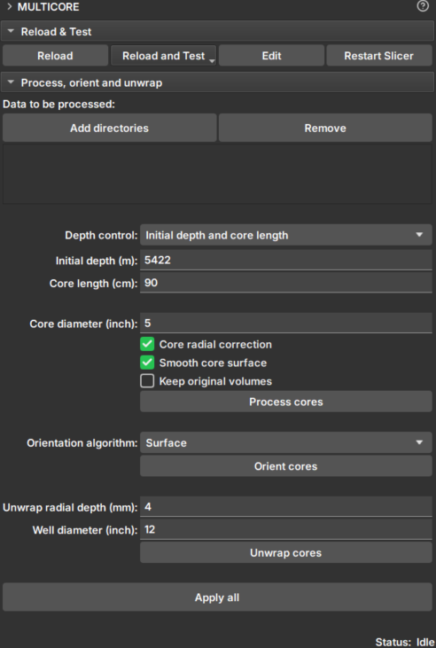

# Multicore

Módulo _GeoSlicer_ para processar, orientar e desdobrar testemunhos em lotes.

## Painéis e sua utilização

|  |
|:-----------------------------------------------:|
| Figura 1: Módulo Multicore. |

### Seleção de dados

- _Add directories_: Adiciona diretórios que contenham dados de _core_. Esses diretórios irão aparecer na lista _Data to be processed_. Durante a execução, a pesquisa pelos dados ocorrerá em apenas um nível abaixo.

- _Remove_: Remove diretórios da lista de pesquisa.

- _Depth control_: Escolha do método de configurar os limites do _core_:
    - _Initial depth and core length_:
        - _Initial depth (m)_: Profundidade do topo do _core_.
        - _Core length (cm)_: Comprimento do _core_.
    - _Core boundaries CSV file_:
        - _Core depth file_: Seletor de um arquivo CSV que contém os limites do core em metros. O arquivo deve ter duas colunas, sendo que cada linha corresponde a um core diferente, na ordem de processamento. As colunas devem indicar, respectivamente, os limites de profundidade superior e inferior.

- _Core diameter (inch)_: Diâmetro aproximado do _core_ em polegadas.

### Processamento
Marque a opção que desejar executar:

- _Core radial correction_: Corrige efeitos de atenuação dos _core CT_, como por exemplo _beam hardening_. Aplica um fator de correção para todas as fatias da imagem (imagens transversais, plano xy) para uniformizar a atenuação em termos de coordenadas radiais. O fator de correção é calculado com base na média de todas as fatias e depende apenas da distância radial em relação ao centro das fatias.

- _Smooth core surface_: Aplica uma suavização (_anti-aliasing_) na superfície do _core_.

- _Keep original volumes_: Salva o dado original sem correções e sem suavização.

- _Process cores_: Processa os cores nos diretórios na ordem em que foram adicionados. Após carregados, os dados podem ser visualizados no módulo _Explorer_ 

### Orientação
- _Orientation algorithm_: Escolha um algoritmo de orientação do _core_:
    - _Surface_: A orientação é baseada no ângulo de corte longitudinal das extremidades do _core_. Essa opção é melhor em casos em que o ângulo de corte não é raso e se as extremidades estão bem preservadas (superfícies de corte mais limpas)
        
    - _Sinusoid_: Utiliza o desenrolamento de _core_ para encontrar os padrões sinusoidais criados pelas camadas deposicionais para orientar os _cores_. Esta opção é boa se as camadas deposicionais estiverem bem pronunciadas no grupo de _cores_.
        
    - _Surface + Sinusoid_: Se o algoritmo _Surface_ for capaz de encontrar um alinhamento, ele será utilizado; caso contrário, o algoritmo _Sinusoid_ será aplicado no lugar.
   
- _Orient cores_: Aplica rotação no eixo longitudinal do _core_, de acordo com o algoritmo selecionado. O primeiro _core_ determina a orientação dos próximos.

### Unwrap
- _Unwrap radial depth (mm)_: insira um valor que varia de 0 até o raio do _core_, em milímetros. Do lado externo do _core_ até o centro, ao longo do eixo radial, é a profundidade na qual o desenrolamento será gerado. Use valores pequenos se desejar desenrolar próximo à superfície do _core_.

- _Well diameter_: Insira o diâmetro aproximado do poço (maior que o diâmetro do _core_) que será utilizado para projetar a imagem do core para a parede do poço.

- _Unwrap cores_: Gera as imagens desenroladas do core. As imagens preservam a escala do core em todos os eixos. Desse modo o tamanho do pixel e upscaling não dependem do raio do _core_. O ângulo delta usado no processo iterativo de coleta de voxels desenrolados são definidos como tamanho_do_pixel/raio.

### Apply all
Aplica todos os passos de processamento, orientação e desenrolamento.
