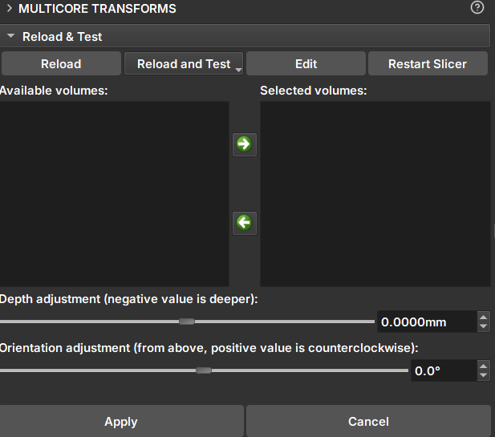

# Multicore Transform

Módulo _GeoSlicer_ para modificar manualmente a orientação e profundidade de _cores_.

## Painéis e sua utilização

|  |
|:-----------------------------------------------:|
| Figura 1: Módulo Multicore Transform. |

### Transform

- _Available volumes/Selected Volumes_: A área _Available volumes_ apresenta os volumes que podem ser modificados pelo módulo. Clicar na seta verde apontando para a direita move os volumes selecionados para a área _Selected Volumes_. Para removê-los dessa área, utilize a seta verde apontando para a esquerda.

- _Depth adjustment_: Aplica translação na profundidade do volume. Valores negativos são mais profundos.

- _Orientation adjustment_: Aplica uma rotação no volume no sentido anti-horário.

- _Apply_: Aplica as mudanças da profundidade e orientação.

- _Cancel_: Cancela as mudanças e limpa os campos anteriores.
