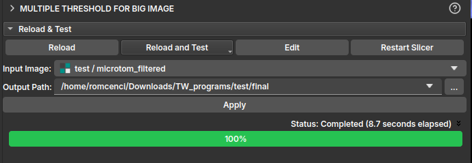

## Multiple Threshold

Esse módulo é utilizado para segmentar uma amostra carregada através do modo Big Image a partir de uma segmentação manual por [Multiple Threshold](./SegmentEditor.md#multiplos-limiares).

Para utilizar esse recurso, primeiro carregue a imagem reduzida a partir do módulo **[Large Image Loader](./LoadBigImage.md)**. Depois de carregada, navegue até o módulo em **[Manual Segmentation](./SegmentEditor.md)** e clique no ícone *Multiple threshold*. Após selecionar os *thresholds* e realizar a segmentação na imagem reduzida, clique em *Apply to full volume*, isso deve redirecionar para a página do presente módulo, onde será escolhido o caminho de saída para salvar o resultado.

