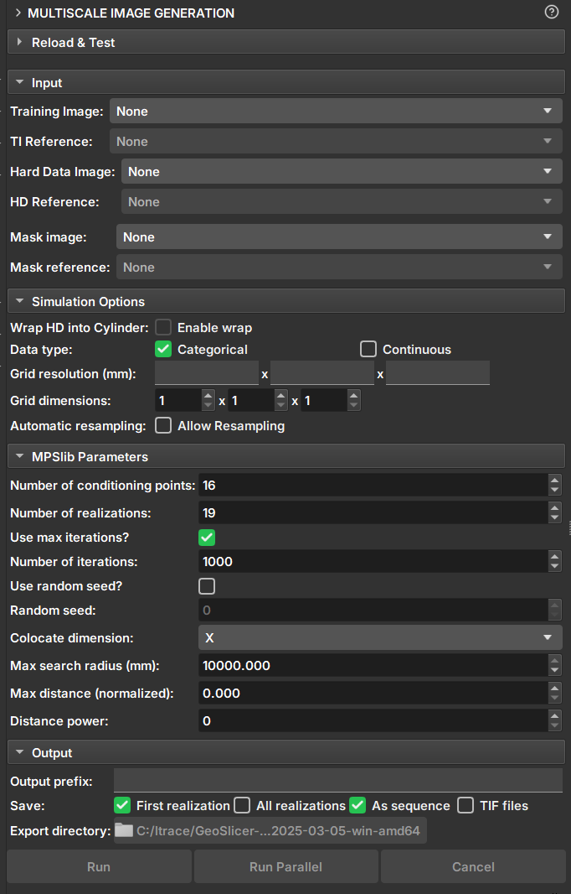

## Image Generation

O módulo Multiscale Image Generation oferece uma interface com diversos parâmetros para a manipulação e configuração da biblioteca [MPSlib](https://mpslib.readthedocs.io/en/latest/). O MPSlib possui um conjunto de algoritmos baseados em modelos estatísticos de múltiplos pontos (MPS - Multiple point statistics) inferidos a partir de uma imagem de treinamento. Atualmente, apenas o algoritmo Generalized ENESIM com modo de amostragem direta (DS - Direct Sampling) está disponível.

### Painéis e sua utilização

|  |
|:-----------------------------------------------:|
| Figura 1: Módulo Multiscale Image Generation. |

#### Dados de entrada

 - _Training Image_: Volume que atua como imagem de treinamento.

 - _Hard Data Image_: Volume que atua como "Hard Data", onde os valores e pontos são fixos durante a simulação.

 - _Mask Image_: Volume que atua como máscara para seleção da área de simulação. Segmentos não selecionados não serão incluídos na simulação.

#### Opções de simulação

 - _Wrap HD into cylinder_: Caso o "Hard Data" seja uma imagem de poço (2D), esta opção faz com que a imagem seja considerada como um cilindro e realize simulações como 3D.

 - _Data type_: Determina se o tipo de dado é contínuo ou categórico. Segmentações e Labelmaps podem ser usadas para simulações discretas e contínuas, mas volumes escalares podem ser usadas apenas para contínua.
   - Categórico: Segmentações controlam regiões e determinam o valor da classe do volume de Hard Data e Imagem de treinamento. Segmentos não selecionados serão desconsiderados.
   - Contínuo: Segmentações controlam quais regiões e valores do volume vão entrar como Hard Data ou dado de treinamento. Segmentos não selecionados serão desconsiderados.

 - _Grid Resolution_: Resolução do voxel da imagem resultante (mm).

 - _Grid Dimensions_: Dimensões da imagem resultante.

 - _Automatic resampling_: Ativa a funcionalidade de redimensionamento automático dos dados de entrada para a dimensão e resolução do grid de simulação. Caso imagem seja um imagelog, o redimensionamento do eixo Y é desabilitado.
    - _Spacing_: Nova resolução do eixo após o redimensionamento.
    - _Size_: Nova dimensão do eixo após o redimensionamento.
    - _Ratio_: Razão da nova resolução do voxel para a resolução inicial.

#### Parâmetros

 - _Number of Conditioning points_: Número de pontos condicionantes a ser utilizado em cada iteração.
 
 - _Number of realizations_: Número de simulações e imagens a serem geradas.

 - _Number of iterations_: Número máximo de iterações a serem realizadas na imagem de treinamento.

 - _Random seed_: Valor usado para iniciar a simulação. Uma mesma seed com os mesmos parâmetros sempre geram o mesmo resultado.

 - _Colocate dimensions_: Para uma simulação 3D, garanta que a ordem nas últimas dimensões seja importante, permitindo uma co-simulação 2D com dados condicionais na terceira dimensão.

 - _Max search radius_: Somente dados condicionais dentro de um raio definido são usados como dados de condicionamento.

 - _Max distance (normalized)_: A distância máxima que levará à aceitação de uma correspondência condicional de modelo. Se o valor for 0, será buscada uma correspondência perfeita.

 - _Distance power_: Pondera os dados de condicionamento com base na distância dos valores centrais. Valor 0 configura sem ponderação. 

#### Opções Saída

 - _Output prefix_: Nome do volume o arquivo gerado. Em caso de múltiplas realizações, um número é adicionado para indicar a realização.

 - _Save_: Opções de formas para salvar os resultados.
   - _First realization_: Salva apenas a primeira realização como volume individual.
   - _All realizations_: Salva todas as realizações como volumes individualmente.
   - _As sequence_: Salva as realizações em um conjunto de sequence. O volume da saída "_proxy" indica ser uma sequência e possui os controladores para a visualização das realizações.
   - _TIF files_: Salva todas as realizações como arquivos tiff.

 - _Export directory_: Diretório em que os arquivos tiff serão salvos. Só é habilitado caso a opção "TIF files" esteja selecionada.

#### Botões

 - _Run_: Executa o mps de forma sequencial. A interface do _Geoslicer_ é travada durante a execução dessa opção.

 - _Run Parallel_: Executa o mps de forma paralela. Nessa opção a execução é executada em outra thread e a interface pode ser usada durante a execução.

 - _Cancel_: Interrompe a execução da simulação. Apenas quando executado de forma paralela.
