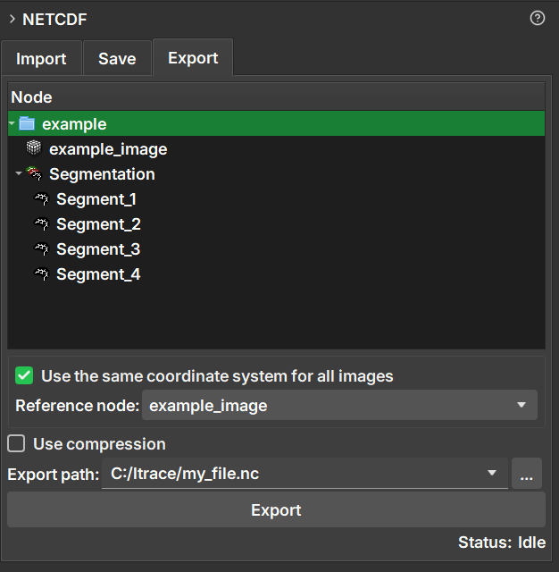

### Exportação NetCDF

A aba **Export** permite salvar um ou mais itens da cena (volumes, segmentações, tabelas) em um **novo** arquivo NetCDF (`.nc`). É a ferramenta ideal para criar um novo conjunto de dados a partir de resultados gerados ou modificados no GeoSlicer.

#### Como Usar

1.  Navegue até o módulo **NetCDF** e selecione a aba **Export**.
2.  Na árvore de hierarquia de dados exibida no módulo, selecione os itens que deseja exportar. Você pode selecionar itens individuais (como volumes ou tabelas) ou pastas inteiras para exportar todo o seu conteúdo.
3.  Escolha o caminho de destino e o nome do novo arquivo no campo **Export path**.
4.  Configure as opções de exportação conforme necessário (detalhadas abaixo).
5.  Clique no botão **Export**.

#### Opções de Exportação

-   **Use the same coordinate system for all images:**
    -   Quando marcada, esta opção garante que todas as imagens exportadas sejam alinhadas espacialmente. As imagens são reamostradas para se ajustarem a um sistema de coordenadas comum, definido pelo **Reference node**.
    -   Isso é útil para garantir o alinhamento, mas pode aumentar o tamanho do arquivo se as imagens tiverem orientações ou espaçamentos muito diferentes, devido à necessidade de preenchimento (_padding_).
    -   Se desmarcada, cada imagem é salva com seu próprio sistema de coordenadas, o que pode resultar em um arquivo menor.

-   **Reference node:**
    -   Ativado apenas quando a opção acima está marcada.
    -   Selecione uma imagem (volume) que servirá como referência para o sistema de coordenadas. Todas as outras imagens serão alinhadas a esta.

-   **Use compression:**
    -   Quando marcada, aplica compressão aos dados, o que reduz o tamanho final do arquivo.
    -   A compressão pode tornar o processo de salvar e carregar o arquivo um pouco mais lento.

#### Diferença entre Export e Save

-   **Export** sempre cria um **novo** arquivo `.nc`.
-   **Save** modifica um arquivo `.nc` **existente** que foi previamente importado.
