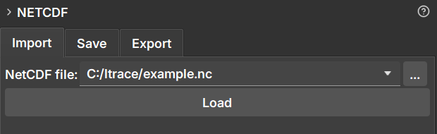

### Importação NetCDF

A aba **Import** é usada para carregar dados de arquivos NetCDF (`.nc`) ou HDF5 (`.h5`, `.hdf5`) para o GeoSlicer.

#### Como Usar

1.  Navegue até o módulo **NetCDF** e selecione a aba **Import**.
2.  Clique no botão de seleção de arquivo ao lado de "NetCDF file:" para abrir o explorador de arquivos.
3.  Selecione o arquivo `.nc`, `.h5` ou `.hdf5` que deseja carregar.
4.  Clique no botão **Load**.

#### Comportamento

Ao carregar um arquivo, o GeoSlicer cria uma nova pasta na hierarquia de dados com o mesmo nome do arquivo. Todos os volumes, segmentações e tabelas contidos no arquivo NetCDF são carregados dentro desta pasta.

Esta pasta de projeto é vinculada ao arquivo original. Essa vinculação é essencial para a funcionalidade de **Save**, que permite atualizar o arquivo original com novos dados gerados no GeoSlicer.
