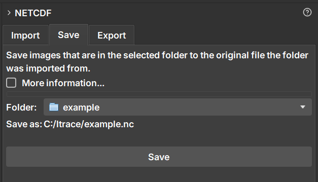

### Salvar Dados em um Arquivo NetCDF Existente

A aba **Save** oferece uma maneira de atualizar um arquivo NetCDF (`.nc`) que foi previamente importado para o GeoSlicer. Ela permite adicionar novos itens (como volumes, segmentações ou tabelas) de uma pasta de projeto de volta ao arquivo original, modificando-o diretamente.

A principal motivação para usar a funcionalidade **Save** é poder salvar alterações ou novos dados (como uma segmentação recém-criada) de volta ao arquivo NetCDF original, **preservando todos os atributos, metadados e a estrutura de coordenadas existentes**. Ao contrário da opção "Export", que cria um arquivo completamente novo, "Save" apenas anexa os novos dados, garantindo que a consistência com o arquivo original seja mantida. Isso é ideal para fluxos de trabalho iterativos, onde você enriquece um conjunto de dados existente sem perder o contexto original.

#### Como Usar

A funcionalidade **Save** foi projetada para um fluxo de trabalho específico:

1.  Primeiro, **importe** um arquivo NetCDF usando a aba **Import**. Isso criará uma pasta de projeto na hierarquia de dados.
2.  Trabalhe no seu projeto. Você pode, por exemplo, criar uma nova segmentação para um volume que estava no arquivo ou arrastar um novo volume para dentro da pasta do projeto.
3.  Navegue até o módulo **NetCDF** e selecione a aba **Save**.
4.  No campo **Folder**, selecione a pasta de projeto que corresponde ao arquivo que você deseja atualizar.
5.  O campo **Save as:** será preenchido automaticamente com o caminho do arquivo original, confirmando para onde as alterações serão salvas.
6.  Clique no botão **Save**.

#### Comportamento

-   A operação **modifica o arquivo original**. É recomendável fazer um backup se você precisar preservar o estado anterior do arquivo.
-   Apenas os **novos** itens dentro da pasta do projeto que ainda não existem no arquivo `.nc` serão adicionados.
-   Itens que já estavam no arquivo **não são sobrescritos ou excluídos**.
-   As novas imagens adicionadas são automaticamente reamostradas para se alinharem ao sistema de coordenadas dos dados já existentes no arquivo.

#### Diferença entre Save e Export

-   **Save** modifica um arquivo `.nc` **existente**, preservando sua estrutura e metadados.
-   **Export** sempre cria um **novo** arquivo `.nc`.
