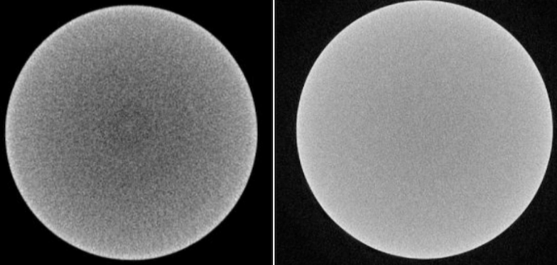

## Polynomial Shading Correction

### Introdução

Imagens de tomografia frequentemente apresentam variações nos valores de intensidade que não são características da amostra, mas sim do
equipamento que as coletou. Essas variações são chamadas de artefatos, e existem diversos tipos deles. O módulo *Polynomial Shading
Correction* corrige o artefato conhecido como beam hardening, entre outros. Também é conhecido como correção de backgroung. 

|                                                                                  |
|:------------------------------------------------------------------------------------------------------------------------:|
| Figura 1: Esquerda: artefato de beam hardening presente. Direita: imagem corrigida após aplicação de shading correction. |

### Método

Todo o procedimento descrito a seguir é feito slice por slice, no plano axial da amostra.

Para cada slice, baseado no parâmetro "Number of fitting points", uma amostra aleatória de valores de intensidade, em pontos pertencentes à máscara de shading. Esses pontos são utilizados para o fit de uma função polinomial de segundo grau em duas variáveis, que define a o background da imagem:

$$ f(x,y) = a (x-b)^2+c(y-d)^2+e(x-b)+f(y-d)+g(x-b)(y-d) + h $$

A função ajustada é então utilizada para fazer a correção no slice, seguindo a equação:

$$ s'(x,y) = \frac{s(x,y)}{f(x,y)}M $$

Onde, $s'(x,y)$ é o slice corrigido, $s(x,y)$ é o slice original e $M$ é a média de todo o dado na máscara de shading (valor constante).
