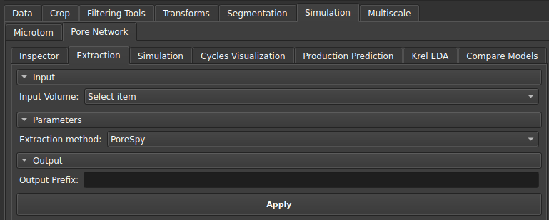
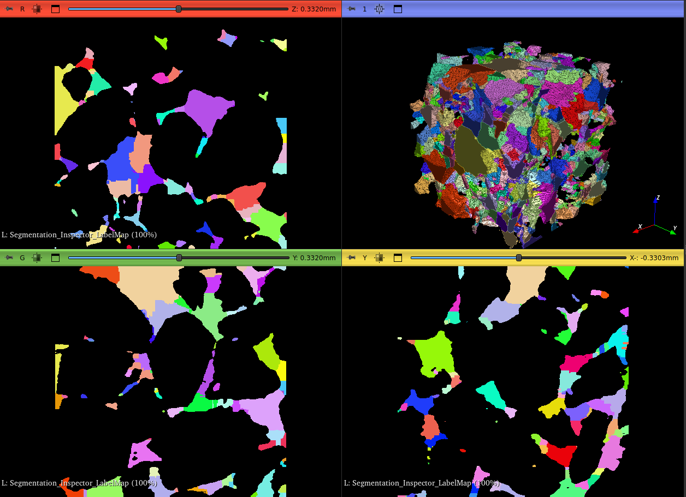
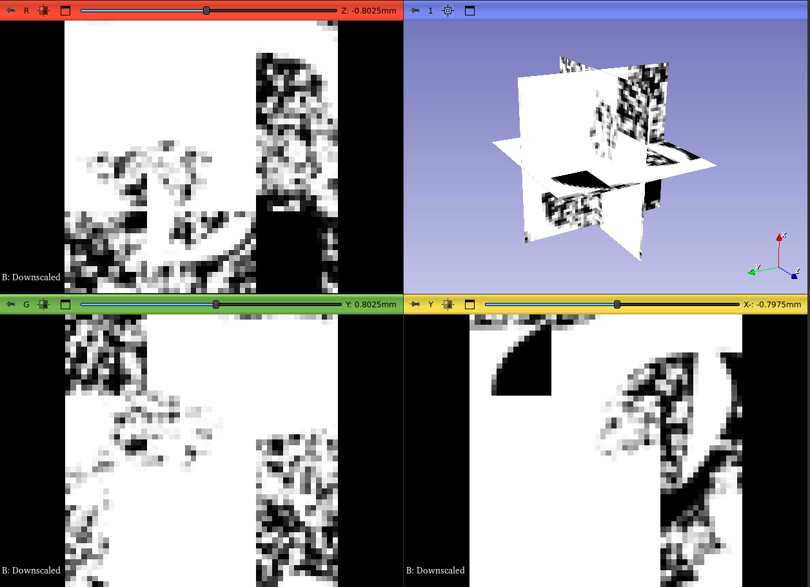
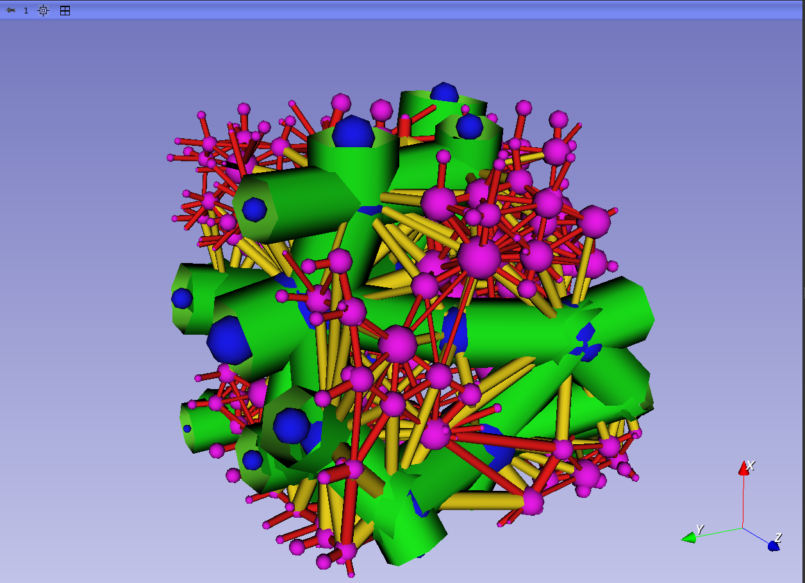

## Extractor

Esse módulo é utilizado para extrair a rede de poros e ligações a partir de: uma segmentação individualizada dos poros (_Label Map Volume_) realizada por um algoritmo de _watershed_, gerando uma rede uniescalar; ou por um mapa de porosidades (_Scalar Volume_), que gerará um modelo multiescalar com poros resolvidos e não-resolvidos.

|  |
|:-----------------------------------------------------------------------:|
| Figura 1: Interface do módulo de Extração. |

Após a extração, ficará disponível na interface do GeoSlicer: as tabelas de poros e gargantas e também os modelos de visualização da rede. As tabelas geradas serão os dados usados na etapa seguinte de simulação.

| { width=50% }{ width=50% } |
|:-----------------------------------------------------------------------:|
| Figura 1: A esquerda Label Map utilizado como entrada na extração e a direita rede uniescalar extraída. |

| { width=50% }{ width=50% } |
|:-----------------------------------------------------------------------:|
| Figura 2: A esquerda Scalar Volume utilizado como entrada na extração e a direita rede multiescalar extraída, onde azul representa poros resolvidos, e rosa representa os poros não-resolvidos. |

**Escala de Cores:**

**Esferas (Poros):**

*    **Azul** - Poro resolvido
*    **Magenta** - Poro não resolvido

**Cilindros (Gargantas):**

*    **Verde** - Garganta entre poros resolvidos
*    **Amarelo** - Garganta entre um poro resolvido e um não resolvido
*    **Vermelho** - Garganta entre poros não resolvidos
