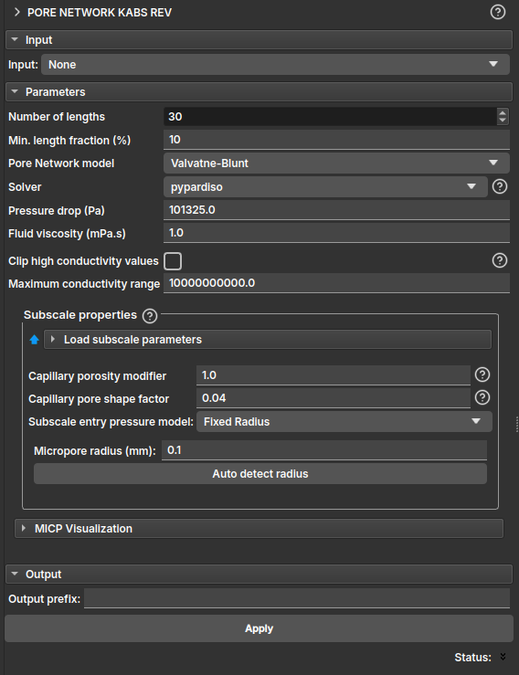

## Pore Network Kabs REV

O módulo **Pore Network Kabs REV** permite executar simulações de uma única fase (permeabilidade absoluta) em múltiplos cortes do volume utilizando a rede de poros.

Ele pode ser usado para avaliar a qualidade na previsão da medida de permeabilidade absoluta, afim de descobrir qual o mínimo tamanho de volume necessário para suprimir o erro devido ao tamanho finito.

- **Input**: Espera como entrada um mapa de porosidades gerado a partir do módulo Microporosity seja por [segmentação](./PorosityFromSegmentation.md) ou por [saturação](./PorosityFromSaturation.md). Caso a entrada seja um mapa de porosidade considerará o modelo multiescala. Também é permitido que o input seja um LabelMap gerado através do módulo [Segment Inspector](./SegmentInspector.md), nesse caso será considerado um modelo de escala simples, e o campo das propriedades Subscala pode ser ignorado.

### Parâmetros (Parameters)

- **Number of lengths**: número de amostras de comprimento (ou cortes) a serem consideradas na simulação;
- **Min. length fraction (%)**: fração mínima de comprimento, em porcentagem, para definição dos cortes;

Os demais parâmetros são equivalentes aos do módulo que realiza a simulação de permeabilidade absoluta. Leia mais no módulo [PNM Simulation](PoreNetworkSimulation.md#one-phase).
