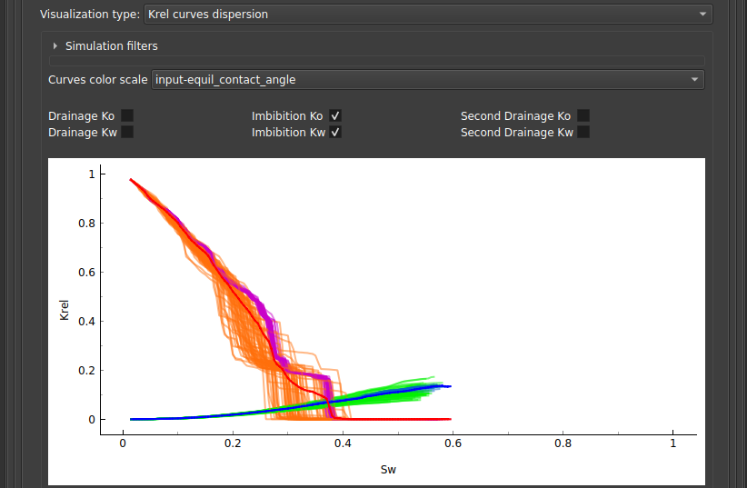
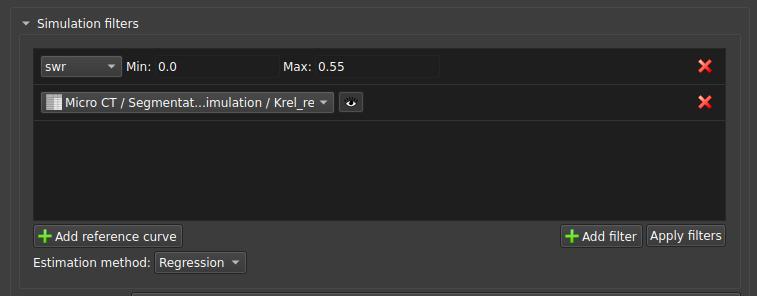
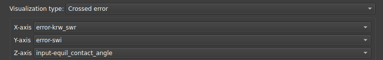
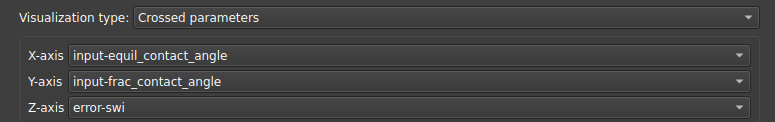
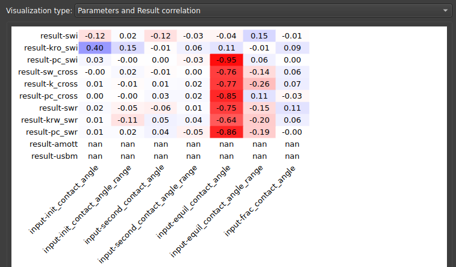
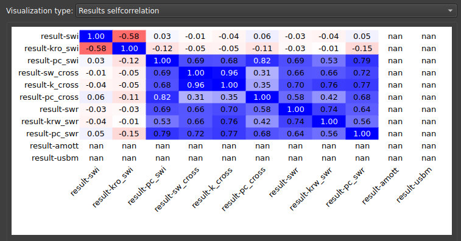
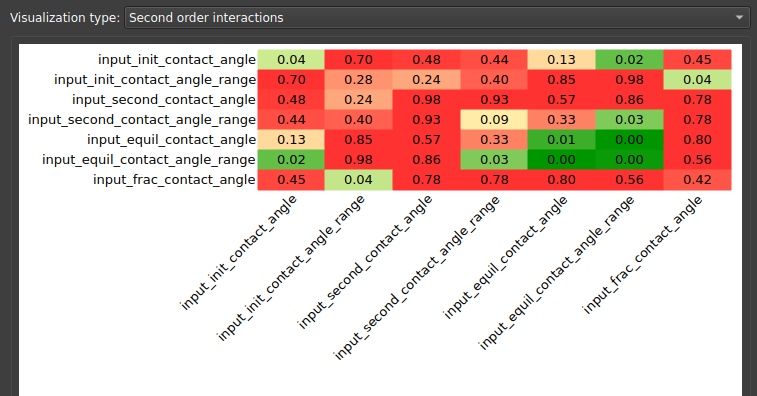
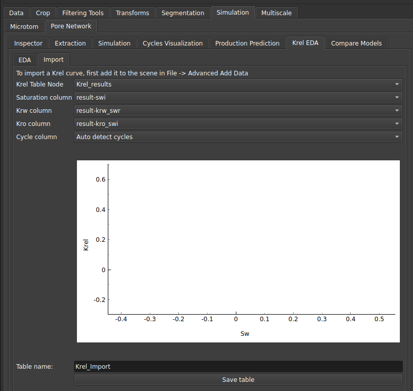

## Krel EDA

### EDA

Para facilitar a análise do conjunto de simulações e entender como os diferentes parâmetros afetam os resultados obtidos, foi criado o módulo do Krel EDA.

Após rodar diversas simulações usando o módulo [Pore Network Simulation](./PoreNetworkSimulation.md#two-phase) o usuário pode colocar como entrada a tabela com os resultados obtidos nesse módulo, para assim visualizar os gráficos da nuvem de curvas, e também fazer um pós-processamento dos seus resultados. 

|  |
|:-----------------------------------------------------------------------:|
| Figura 1: Entrada do módulo Krel EDA. |

Diversas ferramentas foram criadas para facilitar essas análises a partir de gráficos interativos.

#### Krel curves dispersion

Ao selecionar o tipo de visualização como "Krel curves dispersion", será mostrado o gráfico de dispersão das curvas de krel das várias simulações, com a respectiva média dessas curvas.

É possível escolher, através das caixas seletoras localizadas logo acima do gráfico, quais tipos de curva serão mostrados: curvas de drenagem ou embibição e curvas de água e óleo separadamente.

|  |
|:-----------------------------------------------------------------------:|
| Figura 2: Nuvem de curvas Krel. |

Para entender como se dá a distribuição dessas curvas conforme algum dos parâmetros, pode ser selecionado em "Curves color scale" uma escala de cores para as curvas.

##### Filtragem e adição de curvas de referência

Também é possível filtrar a nuvem de curvas para mostrar apenas uma parte dos dados a partir do colapsável nomeado "Simulation filters":

|  |
|:-----------------------------------------------------------------------:|
| Figura 3: Nuvem de curvas Krel filtradas e com curva de referência. |

Ali é possível adicionar um filtro com base em algum parâmetro, e também adicionar uma curva de referência, que pode ser o dado experimental por exemplo, para comparação.

#### Crossed error

Esse tipo de visualização é indicado para comparar a correlação entre os erros nas medidas com algum parâmetro indicado pela escala de cores. A interface permite selecionar o erro de qual medida nos eixos x e y, e também qual parâmetro será indicado na escala de cores.

|  |
|:-----------------------------------------------------------------------:|
| Figura 4: Parâmetros da visualização de erro cruzado. |

#### Crossed parameters

Esse tipo de visualização serve para comparar a correlação entre os parâmetros com o erro indicado pela escala de cores. A interface permite selecionar qual parâmetro será colocado nos eixos x e y, e também qual erro será indicado na escala de cores.

|  |
|:-----------------------------------------------------------------------:|
| Figura 5: Parâmetros da visualização de parâmetros cruzados. |

#### Parameters and Result correlation

Nessa visualização, o usuário pode checar as correlações entre os resultados obtidos da simulação com os parâmetros colocados como entrada no algoritmo, assim pode-se saber quais dos parâmetros mais afetam os resultados. 

|  |
|:-----------------------------------------------------------------------:|
| Figura 6: Correlação entre parâmetros e resultados. |

#### Parameters and Error correlation

Da mesma forma, pode-se querer olhar para as correlações existentes entre os parâmetros e os erros da simulação. Esse tipo de visualização demonstra essa matriz de correlação.

|  |
|:-----------------------------------------------------------------------:|
| Figura 7: Correlação entre parâmetros e erros. |

#### Results selfcorrelation

Para entender como os resultados se correlacionam entre si, ou seja, como a permeabilidade está sendo afetada pela saturação ou pela pressão obtidas na simulação, pode-se olhar para a matriz de autocorrelação dos resultados, apresentada nessa visualização.

|  |
|:-----------------------------------------------------------------------:|
| Figura 8: Matriz de autocorrelação dos resultados. |

#### Higher order interactions

Na análise estatística, podemos também querer entender como são os coeficientes de confiabilidade da correlação, que representam interações de ordens mais altas do que a correlação. Estão disponíveis 3 tipos de visualização para interpretar essas dependência de ordem mais altas: "Second order interactions", "Second order interactions list", "Third order interactions list".

|  |
|:-----------------------------------------------------------------------:|
| Figura 9: Interações de segunda ordem. |

### Import

A aba Import pode ser usada para trazer resultados de uma tabela experimental (por exemplo) com curvas de krel, ao selecionar as colunas correspondentes a saturação, permeabilidade da água, permeabilidade do óleo e o ciclo, o usuário pode salvar uma tabela para ser usada no módulo EDA.

|  |
|:-----------------------------------------------------------------------:|
| Figura 10: Aba Import. |
