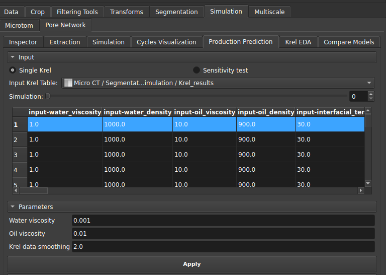
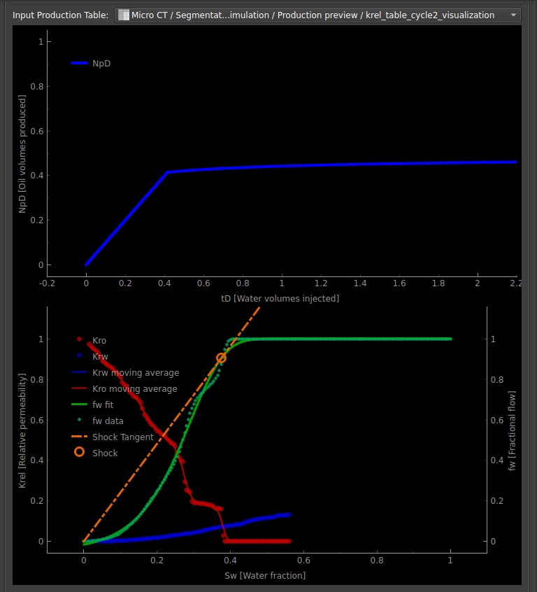
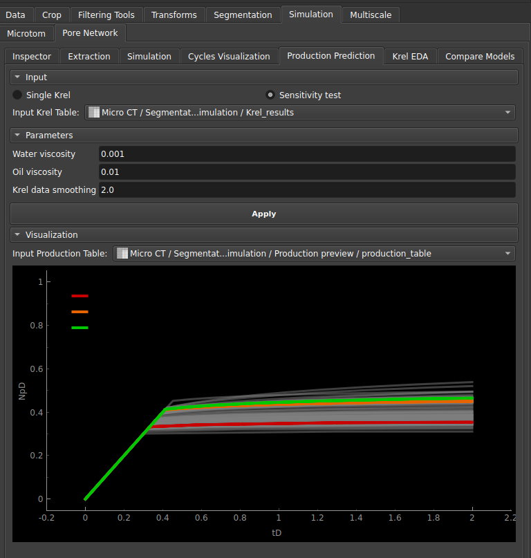

## Production Prediction

Esse módulo pode ser usado para estimar a quantidade de óleo que pode efetivamente ser extraído para uma dada amostra a partir da curva de permeabilidade relativa, usando a equação de Buckley-Leverett.

### Single Krel

A primeira opção disponível usa a curva de permeabilidade relativa construída para uma única simulação de duas fases.

|  |
|:-----------------------------------------------------------------------:|
| Figura 1: Parâmetros do módulo de produção. |

Na interface, além da tabela com os resultados da simulação o usuário pode escolher os valores de viscosidade da água e do óleo que serão usados na estimativa, além de um fator de suavização da curva de krel.

|  |
|:-----------------------------------------------------------------------:|
| Figura 2: Curva de estimativa de produção para simulação única. |

Os gráficos gerados correspondem então a curva da estimativa de produção de óleo (em volume produzido) com base na quantidade de água injetada. E abaixo a curva de permeabilidade relativa com indicação da onda de choque estimada. 

### Teste de sensibilidade

A outra opção pode ser usada quando múltiplas curvas de permeabilidade relativa são geradas.

Nesse caso uma nuvem de curvas será gerada e o algoritmo calcula também as previsões: otimista, pessimista e neutra.

|  |
|:-----------------------------------------------------------------------:|
| Figura 3: Curva de estimativa de produção para o teste de sensibilidade. |