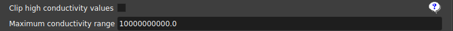
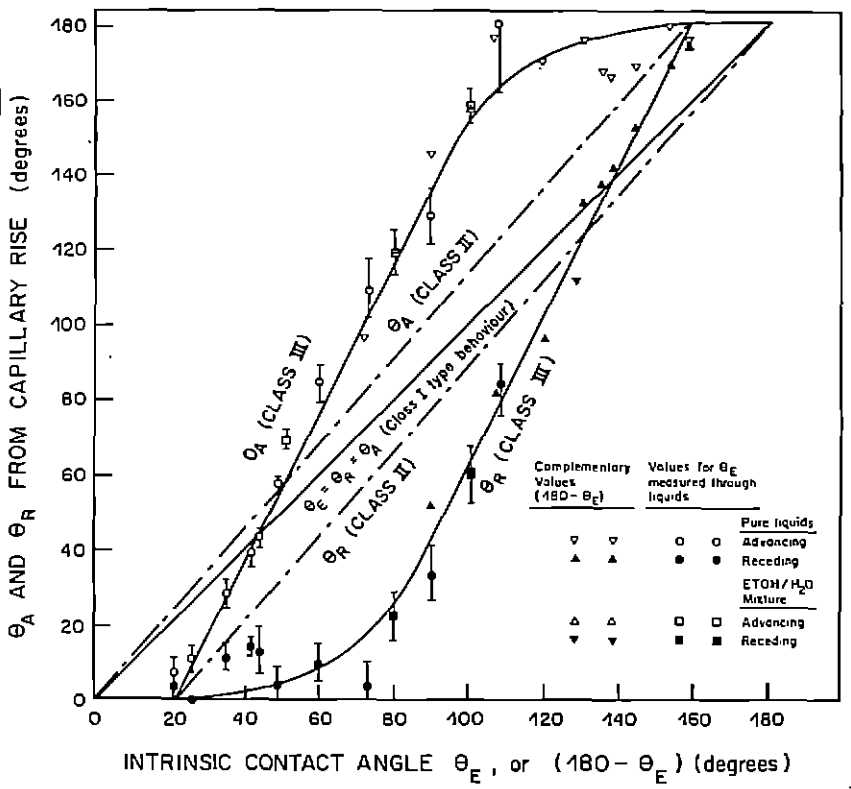
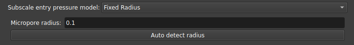

## Simulation

Este módulo pode realizar diferentes tipos de simulações a partir dos resultados da tabela de poros e ligações (criada no módulo de [Extração](./PoreNetworkExtractor.md)). As simulações incluem: [_One-phase_](./PoreNetworkSimulation.md#one-phase), [_Two-phase_](./PoreNetworkSimulation.md#two-phase), [_Mercury injection_](./PoreNetworkSimulation.md#mercury-injection), explicados nas seções adiante.

Todas as simulações possuem os mesmos argumentos de entrada: A tabela de poros gerada a partir da extração da rede e quando o volume for multiescalar, o [modelo subescala](./PoreNetworkSimulation.md#modelo-subscala) utilizado e sua parametrização.

|                                |
|:----------------------------------------------------------------------------:|
| Figura 1: Entrada da tabela de poros gerada com o módulo [Extração](./PoreNetworkExtractor.md). |

### _One-phase_

A simulação de uma fase, é utilizada principalmente para determinar a propriedade de permeabilidade absoluta ($K_{abs}$) da amostra. 

|                                |
|:----------------------------------------------------------------------------:|
| Figura 2: Simulação de uma fase. |

Três diferentes _solvers_ podem ser usados para esse tipo de simulação:
	
- pypardiso (recomendado) : rende os melhores resultados, convergindo mesmo em situações de raios muito discrepantes;
- pyflowsolver : inclui uma opção de seleção do critério de parada, porém com performance menor que o pypardiso;
- openpnm : opção mais tradicionalmente usada;

|                                |
|:----------------------------------------------------------------------------:|
| Figura 3: Opção pyflowsolver e critério de parada. As demais opções (pypardiso e openpnm) não possuem esse critério. |

Quando os valores de condutividade são muito discrepantes para a mesma amostra, e essa amostra percola mais pela subescala, podemos ter problemas na convergência para a solução, por conta disso, adicionamos uma opção para poder limitar os valores em altas condutividades.

|                                |
|:----------------------------------------------------------------------------:|
| Figura 4: Opções de limitação dos valores de condutividade. |

Além disso, a simulação de uma fase pode ser realizada em uma única direção, ou em múltiplas direções, a partir do parâmetro _Orientation scheme_.

|                                |
|:----------------------------------------------------------------------------:|
| Figura 5: Esquema de orientação utilizado. |

### _Two-phase_

A simulação de duas fases consiste em inicialmente injetar óleo na amostra e aumentar a pressão do mesmo afim de que esse invada praticamente todos os poros, num processo que é conhecido como drenagem (_drainage_). Após essa primeira etapa, substitui-se o óleo por água e novamente aumenta-se a pressão, de forma a permitir que a água invada alguns dos poros que antes estavam com óleo, expulsando o último, esse segundo processo é conhecido como embebição (_imbibition_). Ao medirmos a permeabilidade da rocha em relação a permeabilidade absoluta, em função da saturação de água durante esse processo, obtemos a curva conhecida como curva de permeabilidade relativa ($K_{rel}$).

Uma vez que cada rocha pode interagir físicamente ou quimicamente com o óleo e com a água de diferentes maneiras, precisamos de uma variedade bastante grande de parametros que permitam calibrar os resultados de forma a modelar e simplificar essa interação, afim de extrairmos algum significado físico das propriedades da rocha a partir da simulação. Abaixo, elencamos alguns parâmetros que podem ser encontrados na simulação de duas fases disponibilizada no GeoSlicer. 

Atualmente, temos disponível no GeoSlicer dois algoritmos para realizar a simulação de duas fases, a primeira delas é a do PNFlow que é um algoritmo padrão utilizado, implementado em C++, e a segunda é um algoritmo próprio desenvolvido pela LTrace em linguagem Python.

#### Salvar/Carregar tabela de seleção de parâmetros

Para facilitar a reprodução de simulações que rodam no mesmo conjunto de parâmetros, a interface possui opções para salvar/carregar os parâmetros a partir de tabelas que são salvas junto ao projeto. Dessa forma, ao calibrar o conjunto de parâmetros, o usuário pode guardar essas informações para uma outra análise posterior, ou usar esses mesmos parâmetros em outra amostra.

|                                |
|:----------------------------------------------------------------------------:|
| Figura 6: Opções para salvar/carregar tabelas de seleção de parâmetros. |

#### _Fluid properties_

Nessa seção é possível alterar os parâmetros dos fluidos (água e óleo) utilizados na simulação:

|                                |
|:----------------------------------------------------------------------------:|
| Figura 7: Entrada dos parâmetros dos fluidos (água e óleo). |

#### _Contact angle options_

Uma das principais propriedades que afetam a interação de um líquido com um sólido é a molhabilidade, essa pode ser determinada a partir do ângulo de contato formado pelo primeiro quando em contato com o último. Assim, se o ângulo de contato for próximo de zero há uma forte interação que "prende" o líquido ao sólido, já quando o ângulo de contato é próximo a 180º, a interação do líquido com a superfície é fraca e esse pode escoar com mais facilidade pela mesma.

|                                |
|:----------------------------------------------------------------------------:|
| Figura 8: Representação visual do conceito de molhabilidade e ângulo de contato. |

Modelamos os ângulos de contato a partir de duas distribuições usadas em momentos distintos: a _Initial contact angle_ que controla o ângulo de contato dos poros antes da invasão por óleo; e a _Equilibrium contact angle_ que controla o ângulo de contato após a invasão por óleo. Além das distribuições base utilizadas em cada caso, há uma opção para adicionar uma segunda distribuição para cada uma delas, assim cada poro é atrelado a uma das duas distribuições, com o parâmetro "Fraction" sendo usado para determinar qual a porcentagem de poros vão seguir a segunda distribuição em relação a primeira.

|                                |
|:----------------------------------------------------------------------------:|
| Figura 9: Parâmetros das distribuições de ângulo de contato. |

Cada distribuição de ângulos, seja primária ou secundária, inicial ou de equilíbrio, tem uma série de parâmetros que a descreve:

- _Model_: permite modelar as curvas de histerese entre ângulos de avanço/recuo a partir dos ângulos intrínsicos:

	- _Equal angles_: ângulos de avanço/recuo idênticos ao ângulo intrinsico;
	- _Constant difference_: diferença constante dos ângulos de avanço/recuo em relação ao ângulo intrínsico;
	- _Morrow curve_: curvas de avanço/recuo determinadas pelas curvas de Morrow;

| { width=50% } |
|:---------------------------------------------------------------------:|
| Figura 10: Curvas para cada um dos modelos de ângulo de contato implementados no GeoSlicer. Imagem retirada de N. R. Morrow, 1975 (https://doi.org/10.2118/75-04-04). |

- _Contact angle distribution center_: Define o centro da distribuição de ângulo de contato;
- _Contact angle distribution range_: Alcance da distribuição (center-range/2, center+range/2), com o ângulo mínimo/máximo sendo 0º/180º, respectivamente;
- _Delta_, _Gamma_: Parâmetros da distribuição de Weibull truncada, se um número negativo é escolhido, usa uma distribuição uniforme; Se números positivos são escolhidos, usa a seguinte distribuição de probabilidades: $p(\tilde\theta)=\frac{\gamma}{\delta}\frac{\tilde\theta^{\gamma-1}e^{-\tilde\theta^\gamma/\delta}}{1-e^{-1/\delta}}$ onde $\tilde\theta\in[\theta_{min},\theta_{max}]$. Algumas ideias de parâmetros para essa distribuição são gráficados abaixo:

| { width=50% } |
|:---------------------------------------------------------------------:|
| Figura 1: Distribuição de Weibull. |

- _Contact angle correlation_: Escolhe como o ângulo de contato será correlacionado ao raio dos poros: _Positive radius_ define maiores ângulos de contato para raios maiores; _Negative radius_ faz o oposto, atribuindo maiores ângulos para raios menores; _Uncorrelated_ significa independência entre ângulos de contato com o raio do poro;
- _Separation_: Se o modelo escolhido for _constant difference_, define a separação entre ângulos de avanço e recuo;

Outros parâmetros estão definidos apenas para a segunda distribuição:

- _Fraction_: Um valor entre 0 e 1 que controla qual a fração dos poros usará a segunda distribuição ao invés da primeira; 
- _Fraction distribution_: Define se a fração será determinada pela quantidade de poros ou volume total;
- _Correlation diameter_: Se a _Fraction correlation_ for escolhida como _Spatially correlated_, define a distância mais provável de encontrar poros com mesma distribuição de ângulo de contato;
- _Fraction correlation_: Define como a fração para a segunda distribuição será correlacionada, se correlacionada espacialmente, para maiores poros, menores poros ou aleatória;

#### _Simulation options_

Essa seção de parâmetros é dedicada a controlar os parâmetros relacionados a própria simulação.

|                                |
|:----------------------------------------------------------------------------:|
| Figura 12: Parâmetros da simulação. |

- _Minimum SWi_: Define o valor mínimo de SWi, interrompendo o ciclo de drenagem quando o valor de Sw é atingido (SWi pode ser maior se a água ficar presa);
- _Final cycle Pc_: Interrompe o ciclo quando essa pressão capilar é alcançada;
- _Sw step length_: Passo de Sw utilizado antes de verificar o novo valor de permeabilidade;
- _Inject/Produce from_: Define por quais lados o fluido será injetado/produzido ao longo do eixo z, o mesmo lado pode tanto injetar como também produzir;
- _Pore fill_: Determina qual mecanismo domina cada evento de preenchimento de poro individual;
- _Lower/Upper box boundary_: Poros com distância relativa no eixo Z da borda até este valor do plano são considerados poros "à esquerda"/"à direita", respectivamente;
- _Subresolution volume_: Considera que o volume contém essa fração de espaço poroso em subresolução que está sempre preenchido com água;
- _Plot first injection cycle_: Se selecionado, o primeiro ciclo, injeção de óleo em um meio totalmente saturado de água, será incluído no gráfico de saída. A simulação será executada, independentemente da opção estar selecionada ou não;
- _Create animation node_: Cria um nó de animação que pode ser usado na aba "Cycles Visualization";
- _Keep temporary files_: Mantém os arquivos .vtu na pasta de arquivos temporários do GeoSlicer, um arquivo para cada etapa da simulação;
- _Max subprocesses_: Quantidade máxima de subprocessos single-thread que devem ser executados; O valor recomendado para uma máquina ociosa é 2/3 do total de núcleos;

Uma vez que temos uma vasta quantidade de parâmetros que podem ser modificados para modelar o experimento a partir da simulação, se torna útil variarmos tais parâmetros de forma mais sistemática para uma análise aprofundada da sua influência nos resultados obtidos. 

Para isso o usuário pode selecionar o botão "_Multi_" disponível em grande parte dos parâmetros, ao clicar em Multi, três caixas aparecem com opções de início, fim e passo, que podem ser usadas para rodar diversas simulações em uma tabela linearmente distribuída dos valores desses parâmetros. Se mais de um parâmetro é escolhido com múltiplos valores, simulações rodam com todas as combinações de parâmetros possíveis, isso pode aumentar consideravelmente a quantidade de simulações e o tempo para executar.

Ao finalizar a execução do conjunto de simulações, o usuário pode realizar análises para entender as relações entre os resultados das simulações com os parâmetros escolhidos na aba _Krel EDA_.

### _Mercury injection_

Além das simulações de uma e duas fases, também temos disponível nesse módulo uma simulação do experimento de intrusão de Mercúrio.

|                                |
|:----------------------------------------------------------------------------:|
| Figura 13: Simulação de intrusão de Mercúrio. |

A intrusão de mercúrio é um experimento no qual mercúrio líquido é injetado em uma amostra de rocha reservatório sob vácuo, com pressão crescente. O volume de mercúrio invadindo a amostra é medido em função da pressão de mercúrio. Uma vez que o ângulo de contato do mercúrio líquido com o vapor de mercúrio é aproximadamente independente do substrato, é possível utilizar modelos analíticos, como o modelo do feixe de tubos, para calcular a distribuição do tamanho dos poros da amostra. 

O ensaio de intrusão de mercúrio é relativamente acessível e sua principal relevância no contexto do PNM reside na capacidade de executar a simulação em uma amostra para a qual os resultados experimentais de curvas de Pressão Capilar por Intrusão de Mercúrio (MICP) estão disponíveis. Isso permite a comparação dos resultados para validar e calibrar a rede de poros extraída da amostra, que será usada nas simulações de uma e duas fases.

Para facilitar as análises da atribuição dos raios dos poros sub-resolução, o código presente no GeoSlicer produzirá como saída, além dos gráficos obtidos pela simulação no OpenPNM, os gráficos das distribuições de raios de poros e gargantas e também das distribuições de volumes, separando em poros resolvidos (que não se alteram pela atribuição da subescala) e poros não resolvidos. Dessa forma, o usuário pode conferir se o modelo de subescala foi aplicado corretamente.

### Modelo Subscala

No caso da rede multiescalar, como os raios da subescala não podem ser determinados a partir da própria imagem, por estarem fora da resolução, é necessário definir um modelo para atribuição desses raios. Algumas opções disponíveis atualmente são:

- _Fixed radius_: Todos os raios da subresolução tem o mesmo tamanho escolhido na interface;

- _Leverett Function - Sample Permeability_: Atribui uma pressão de entrada com base na curva de J Leverett com base na permeabilidade da amostra;

- _Leverett Function - Permeability curve_: Também utiliza a curva de J Leverett mas com uma curva definida para a permeabilidade ao invés de um valor;

- _Pressure Curve_ e _Throat Radius Curve_: Atribui os raios da subresolução com base na curva obtida por um experimento de injeção de mercúrio. Pode ser utilizado o dado da pressão de entrada pela fração do volume, ou então o raio equivalente em função da fração de volume;

O modelo de subescala escolhido não tem impacto nas simulações de redes uniescalares, uma vez que todos os raios já estão determinados. 