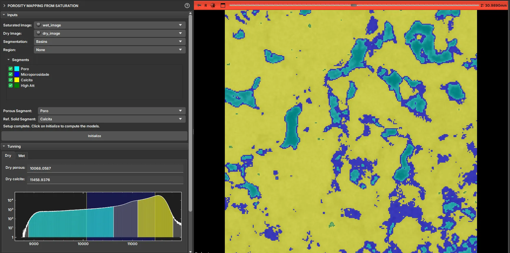

## Mapa de porosidade via saturação

Esse módulo é utilizado para gerar o mapa de porosidade para uma amostra específica a partir da comparação entre a amostra seca e a saturada.

As entradas necessárias para a utilização do módulo são:

- Imagem seca e saturada da amostra;

- Segmentação das fases com pelo menos dois dos segmentos representando: o espaço poroso e o sólido;

> As imagens seca e saturada devem estar registradas para que esse módulo funcione adequadamente.

Ao selecionar a Segmentação, o módulo reconhece automaticamente os nomes "Poro" para o espaço poroso e o nome "Calcita" para o sólido de referência. No entanto, o usuário pode alterar qual dos segmentos representa cada uma das fases que serão utilizadas para delimitar o mapa de porosidade, nos valores 0 (sólido) e 1 (poro). Quaisquer outros segmentos não selecionados estarão compreendidos na fase intermediária em porosidade (escala de cinza).

Após selecionar os segmentos pode-se clicar em "Inicializar", isso fará com que o módulo calcule e colore apropriadamente os histogramas da imagem seca e da saturada. Enquanto as cores representam os segmentos (normalmente serão delimitados por linhas retas no caso da segmentação ter sido gerada por threshold), as barras indicarão onde o mapa de porosidade será limitado para os valores de 0 e 1. Os valores intermediários serão escalados adequadamente com base no alcance das barras. Normalmente os valores padrão já são bons.