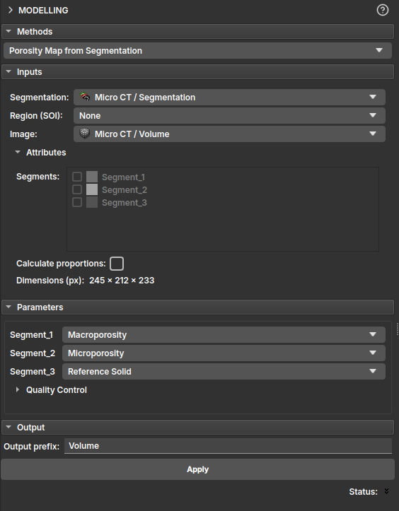

## Mapa de porosidade via Segmentação

Nesse módulo o mapa de porosidade pode ser gerado a partir dos dados de microtomografia e de uma segmentação feita em cima dele. Após selecionar a segmentação, pode-se escolher a classificação de cada um dos segmentos em Macroporosity, Microporosity, Reference Solid e High Attenuation. Com isso, o algoritmo gerará um mapa de porosidade onde os segmentos classificados como Macroporosity serão sempre 1, Reference Solid e High Attenuation serão 0 e os segmentos indicados por Microporosity estarão em uma escala de cinza entre 0 e 1.

