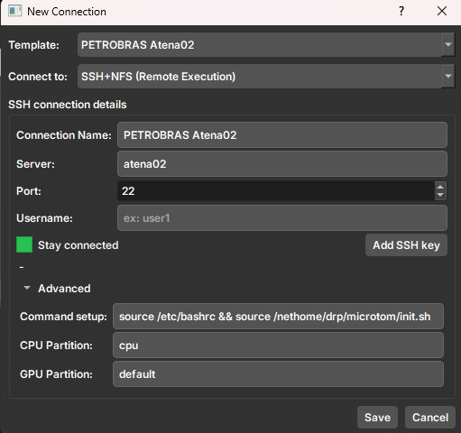
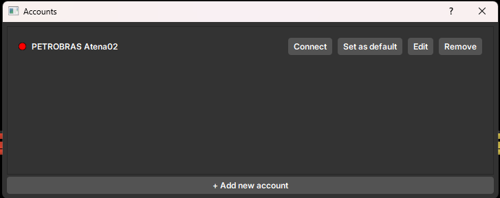
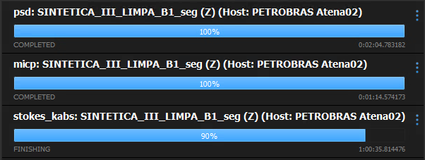

O GeoSlicer permite que o usuário conecte-se a uma conta remota, via ssh, para acessar recursos computacionais como
clusters. Atualmente o modelo implementado está bastante atrelado ao requisitos de execução da Petrobras, no entando
quanlquer máquina pode ser acessada pelo módulo **_Job Monitor_**, desde que ela tenha acesso SSH liberado e acessível
na rede.

## Conexão

A conta deve ser cadastrada, como pode ser visto na Figura 1. O usuário deve preencher os campos de acordo com as
suas credencias de acesso. Caso o usuário tenha uma chave SSH, ele pode inserir o caminho para a chave clicando em **Add
Key**.

Observe que o usuário pode configurar outro paramêtros relativos ao que vai acontecer quando a conexão for estabelecida.
Como por exemplo, o _"Command Setup"_ que é o comando que é executado imediatamente ao estabelecer a conexão. Os demais
parametros são especificidades do cluster da Petrobras.

## Contas

As contas cadastradas são gerenciadas na tela de contas, como pode ser visto na Figura 2. Nela o usuário pode ver
quais contas estão ativas, remover e editar as contas cadastradas.

## Job Monitor

O módulo **_Job Monitor_** é responsável por monitorar os jobs que estão sendo executados na máquina remota. Através
dele o usuário pode acompanhar o progresso das tarefas em execução. Atualmente, apenas as tarefas do módulo  *
*_Microtom_** são enviadas remotamente. O **_Job Monitor_** é acessado através do barra de dialogos, no canto inferior
direito.

