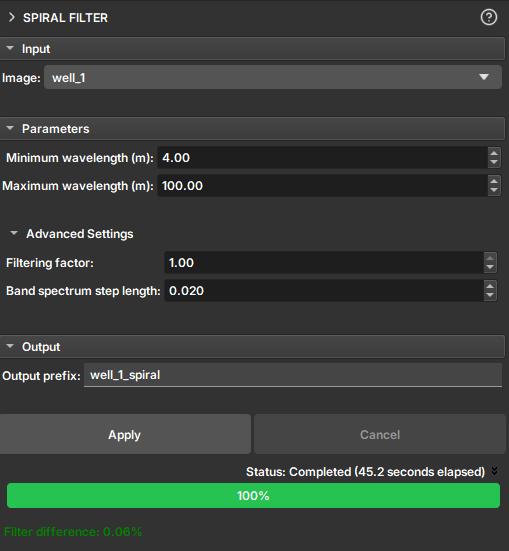

## Spiral Filter

O módulo **Filtro Espiral** é uma ferramenta projetada para remover artefatos de perfis de imagem causados pelo movimento espiral e pela excentricidade da ferramenta de perfilagem dentro do poço.

Durante a aquisição de perfis de imagem, o movimento de rotação da ferramenta (espiralamento) e seu desalinhamento em relação ao centro do poço (excentricidade) podem introduzir um ruído periódico nas imagens. Esse ruído aparece como um padrão de faixas ou espirais sobreposto aos dados geológicos, o que pode dificultar a interpretação de feições verdadeiras.

Este filtro atua no domínio da frequência para remover seletivamente as componentes de sinal associadas a esses artefatos, resultando em uma imagem mais limpa e fácil de interpretar.

### Como Funciona

O filtro é baseado na aplicação de um filtro de rejeição de banda na transformada de Fourier 2D da imagem. A banda de frequência a ser rejeitada é definida pelos comprimentos de onda verticais (em metros) que correspondem ao padrão espiral visível na imagem. O usuário pode medir esses comprimentos de onda diretamente na imagem usando a ferramenta de régua para configurar os parâmetros do filtro.

### Como Usar

1.  **Image:** Selecione o perfil de imagem que você deseja filtrar.
2.  **Parameters:**
    *   **Minimum wavelength (m):** Defina o comprimento de onda vertical mínimo do artefato espiral. Este valor corresponde à menor distância vertical de repetição do padrão.
    *   **Maximum wavelength (m):** Defina o comprimento de onda vertical máximo do artefato.
3.  **Advanced Settings (Opcional):**
    *   **Filtering factor:** Controle a intensidade do filtro. Um valor de `0` não aplica nenhuma filtragem, enquanto `1` aplica a filtragem máxima.
    *   **Band spectrum step length:** Ajusta a suavidade da transição da banda de frequência do filtro. Valores maiores resultam em uma transição mais suave.
4.  **Output prefix:** Defina o nome para o novo volume de imagem filtrado.
5.  **Clique em Apply:** Pressione o botão para iniciar o processo de filtragem.

### Saída

O resultado é um novo volume de imagem na cena com o filtro aplicado. Após a execução, o campo **Filter difference** exibe a porcentagem da imagem que foi alterada pelo filtro, dando uma medida quantitativa do impacto da filtragem.
