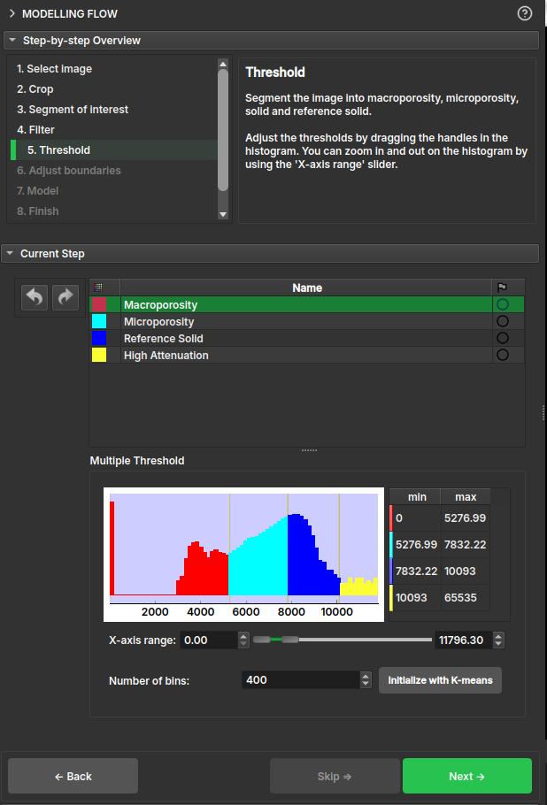

# Modelling Flow

Esse módulo tem o intuito de resumir o fluxo para geração do mapa de porosidade a partir de um volume de microCT. Para isso, o módulo divide o fluxo nos seguintes passos:

1. **Select image**: Seleciona um volume carregado na cena;
2. **Crop**: Realizar um corte no volume original;
3. **Segment of interest**: Permite a seleção de uma região de interesse para a modelagem. Pode ser usada a ferramenta de tesoura ou o *Sample segmentation* que tentará selecionar o cilindro de forma automática;
4. **Filter**: Aplica um filtro de mediana na imagem original, o usuário deve escolher a quantidade de vizinhos usados para em cada direção;
5. **Threshold**: Criação da segmentação com base na escala de cinza;
6. **Adjust boundaries**: Remove uma borda selecionada da microporosidade expandindo os demais segmentos para preencherem o espaço vazio;
7. **Model**: Calcula o mapa de porosidade, usando um histograma para seleção dos fatores de atenuação do sólido e do ar;
8. **Finish**: Visualização dos resultados;

Quando a opção for opcional, o botão de *Skip* ficará habilitado, permitindo pular esse passo.

