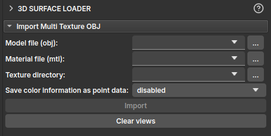

## 3D Surface Loader

O módulo **3D Surface Loader** é uma ferramenta projetada para carregar e visualizar modelos de superfície 3D texturizados no ambiente do GeoSlicer. Sua principal finalidade é importar modelos no formato `.obj` que são acompanhados por arquivos de material (`.mtl`) e texturas de imagem, aplicando essas texturas à geometria do modelo para uma visualização 3D da superfície da rocha. Normalmente, tais imagens são provenientes de scanners 3D.

### Como usar

A interface do módulo é direta, focada na importação de modelos com múltiplas texturas.

As opções principais opções disponíveis para importar o modelo 3D são:

1.  **Model file (obj):** Selecione o arquivo de modelo 3D com a extensão `.obj` que você deseja carregar.
2.  **Material file (mtl):** Selecione o arquivo de material correspondente, com a extensão `.mtl`. O módulo tentará preencher este campo automaticamente se um arquivo `.mtl` com o mesmo nome do arquivo `.obj` for encontrado no mesmo diretório.
3.  **Texture directory:** Especifique o diretório onde as imagens de textura (por exemplo, arquivos `.png` ou `.jpg` referenciados pelo arquivo `.mtl`) estão localizadas. O módulo também tentará preencher este campo automaticamente com base no caminho do arquivo do modelo.
4.  **Save color information as point data :** Esta opção permite salvar as cores da textura como atributos do modelo. Isso pode ser útil para análises ou filtros subsequentes baseados em cor. As opções são:
    *   `disabled`: Não salva informações de cor nos pontos.
    *   `separate scalars`: Salva os canais de cor (Vermelho, Verde, Azul) como arrays escalares separados.
    *   `single vector`: Salva a informação de cor como um único vetor de 3 componentes (RGB).
5.  **Import:** Após preencher os campos, clique neste botão para carregar o modelo e suas texturas na cena.
6.  **Clear views:** Desabilita as slices normalmente utilizadas no slicer, para visualizar apenas o modelo 3D.
