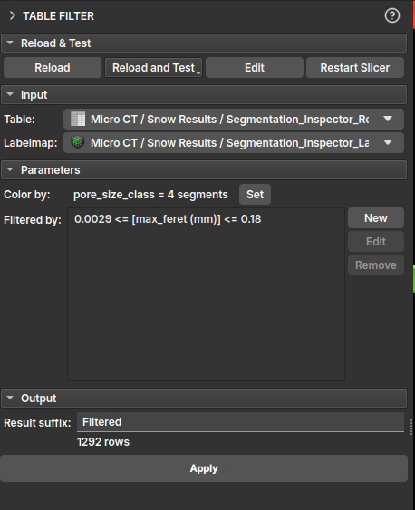
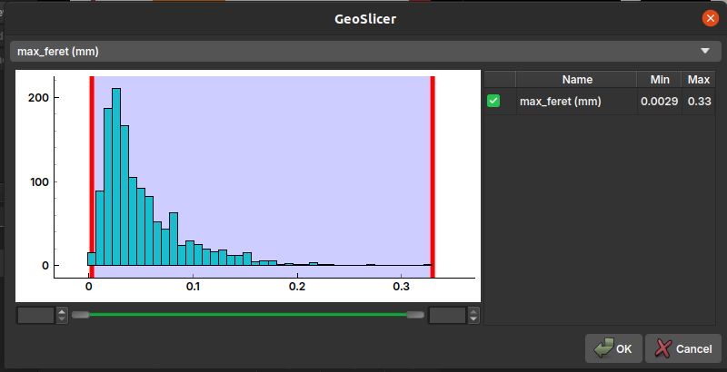
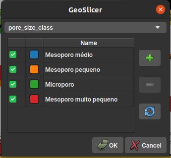

## Table Filter

Este módulo filtra tabelas de propriedades de elementos (como poros ou grãos) que foram individualizados por algoritmos de segmentação. Para mais detalhes sobre a origem desses dados, consulte a documentação do [Segment Inspector](SegmentInspector.md).

Na interface do módulo, o usuário pode selecionar a tabela de entrada e construir filtros específicos para cada uma de suas colunas. Uma funcionalidade central deste módulo é o feedback visual instantâneo: à medida que os filtros são aplicados, os elementos correspondentes no LabelMap são atualizados em tempo real, permitindo uma análise visual e interativa.

É possível adicionar múltiplas regras para criar um filtro complexo, e o usuário pode optar por manter ou remover as linhas que atendem aos critérios estabelecidos.

Também é possível atribuir uma cor diferente para cada classe de poros, facilitando a visualização e análise. Por padrão, a cor está associada à classificação *pore_size_class*.

### Descrição das Propriedades

- *label*: Um índice único para cada um dos elementos individualizados;
- *voxelCount*: O número de voxels que compõem cada elemento;
- *volume (mm³)*: O volume real do elemento, calculado a partir do `voxelCount` e do tamanho do voxel da imagem;
- *max_feret (mm)*: O diâmetro de Feret máximo, que representa a maior distância entre dois pontos paralelos na borda do elemento. É uma medida do tamanho máximo do elemento;
- *aspect_ratio*: A razão de aspecto, geralmente calculada como a razão entre o maior e o menor eixo do elemento. Um valor próximo de 1 indica que o elemento é aproximadamente isométrico (como uma esfera ou cubo), enquanto valores maiores indicam uma forma mais alongada;
- *elongation*: Mede o quão alongado é um objeto. É a raiz quadrada da razão entre o segundo e o primeiro momento de inércia do objeto. Um valor de 0 corresponde a um círculo ou esfera, e valores maiores indicam um maior alongamento;
- *flatness*: Mede o quão achatado é um objeto. É a raiz quadrada da razão entre o terceiro e o segundo momento de inércia do objeto. Um valor de 0 corresponde a um círculo ou esfera, e valores maiores indicam um maior achatamento.;
- *ellipsoid_area (mm²)*: A área da superfície de um elipsoide que tem os mesmos momentos de inércia do elemento;
- *ellipsoid_volume (mm³)*: O volume de um elipsoide que tem os mesmos momentos de inércia do elemento.
- *ellipsoid_area_over_ellipsoid_volume (1/mm)*: A razão entre a área da superfície e o volume do elipsoide equivalente. Esta medida é útil para caracterizar a relação superfície/volume do elemento;
- *sphere_diameter_from_volume (mm)*: O diâmetro de uma esfera que tem o mesmo volume que o elemento. É uma forma de estimar um diâmetro "equivalente" para formas irregulares;
- *pore_size_class*: Uma classificação categórica do tamanho do poro (por exemplo, microporo, mesoporo, macroporo) com base em uma das medidas de tamanho;
