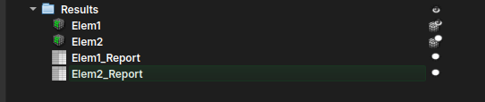
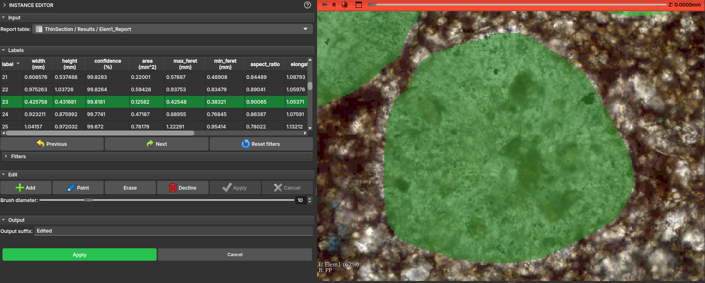
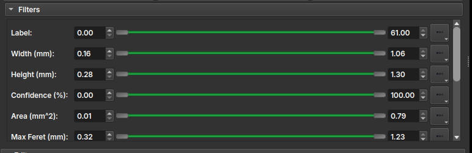

## Instance Editor

Esse módulo é utilizado para manipular e fazer uma inspeção rótulo-a-rótulo dos resultados gerados a partir de um modelo "Textural Structures" do AI Segmenter. Ao utilizar o módulo do AI Segmenter com esse modelo em uma imagem de lâmina, o resultado deve ser algo como:

Após gerados os resultados da segmentação por instâncias, o usuário pode querer repintar, limpar ou até inspecionar cada uma das instâncias criadas, sendo assim, ao carregar alguma das tabelas de Report no módulo Instance Editor, o mesmo automaticamente deve mostrar o volume LabelMap associado a tabela.

!!! tip
	Pode ser escolhida uma opacidade das labels para melhor visualizar a amostra que está sobre ela. Uma das maneiras práticas de fazer isso é segurando o botão `Ctrl` e arrastando o mouse horizontalmente enquanto clica dentro da janela de visualização.

A interface do módulo mostrará uma tabela com as principais propriedades do desenho feito e o usuário pode então, ao clicar nas entradas da tabela ou usando os botões Next e Previous, visitar cada um dos elementos individualmente.

Além disso, a interface conta com uma ferramenta de Filtros que lista todas as propriedades e permite selecionar um certo intervalo dessas propriedades aplicando uma cor aos elementos da tabela e permitindo ao usuário mais facilmente decidir se deve manter ou excluir esse elemento.

No campo Edit, são apresentadas algumas ferramentas de edição dos rótulos, entre elas:
 - *Add*: Adiciona uma nova instância/rótulo a tabela, permitindo que o usuário desenhe a mão sobre a visualização da lâmina;
 - *Paint*: Aciona uma ferramenta de pincel, para utilizar sobre uma instância já existente;
 - *Erase*: Aciona uma ferramenta de borracha, para apagar uma parte da instância existente;
 - *Decline*: Exclui a entrada da instância tanto da tabela quanto do desenho;
 - *Apply*: Aplica a mudança atual, recalculando as propriedades do desenho;
 - *Cancel*: Descarta a mudança atual;

!!! info
	Todas as mudanças feitas são temporárias, para aplicá-las e gerar uma nova tabela e um novo LabelMap com os desenhos é necessário finalizar as mudanças apertando no botão de "Apply" geral, disponível mais abaixo na interface.