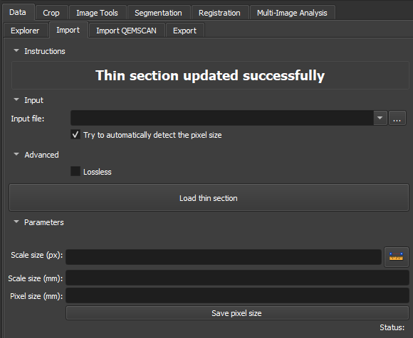

# Thin Section Loader

O módulo ThinSectionLoader foi projetado para carregar e processar com eficiência imagens de seção fina no ambiente _Thin section_. Ele importa imagens PNG, JPG/JPEG, BMP, GIF, e TIFF. Ele integra detecção automatizada de escala usando Tesseract OCR, garantindo uma estimativa precisa do tamanho do pixel. O módulo também inclui opções avançadas para manipulação de imagens sem perdas e permite ajustes manuais nos parâmetros de espaçamento das imagens, tornando-o adaptável a diversas necessidades de análise geológica.

## Painéis e sua utilização

|  |
|:-----------------------------------------------:|
| Figura 1: Apresentação do módulo Thin Section Loader. |

### Principais opções

 - _Input file_: Escolha o caminho da Imagem a ser importada. As extenções mais usadas são:PNG, JPG/JPEG, BMP, GIF, e TIFF.

 - _Advanced Lossless_: Utilizar uma opção de compressão lossless garante que a qualidade original da imagem seja preservada integralmente, sem perda de dados durante o processo.

 - _Scale size(px)_: Seção para definir a faixa de pixels usada na proporção de pixels por milímetro. O ícone de régua à direita permite adicionar uma marcação na escala da imagem, facilitando essa definição.

 - _Scale size(mm)_: Seção para definir o tamanho em milímetros da faixa de pixels selecionada. Se a régua foi utilizada na escala da imagem, o valor deverá ser correspondente.

 - _Pixel size(mm)_: Proporção entre pixels/mm pode ser definida ou resultante da medida dos campos _Scale size(px)_ e _Scale size(mm)_

 - _Save pixel size_: Definida a proporção entre pixels/mm o botão atrela o valor à imagem.

## Fluxo

### PP / PX / Outros

{{ video("thin_section_loader.webm", caption="Thin Section Loader") }}

Utilize o Módulo *Loader* para carregar imagens de seção delgada, conforme descrito nos passos abaixo:

1.  Use o botão *Add directories* para adicionar diretórios contendo dados de seção delgada. Esses diretórios apareceção na área *Data to be loaded* (uma busca por dados de seção delgada nesses diretórios ocorrerá em subdiretórios abaixo em no máximo um nível). Pode-se também remover entradas indesejadas selecionando-as e clicando em *Remove*.
2.  Defina o tamanho do pixel (*Pixel size*) em milímetros.
3.  Opcionalmente, ative *Try to automatically detect pixel size*. Se funcionar, o tamanho de pixel detectado substituirá o valor configurado em *Pixel size*.
4.  Clique no botão *Load thin sections* e aguarde o carregamento ser finalizado. As imagens carregadas podem ser acessadas na aba *Data*, dentro do diretório *Thin Section*.
