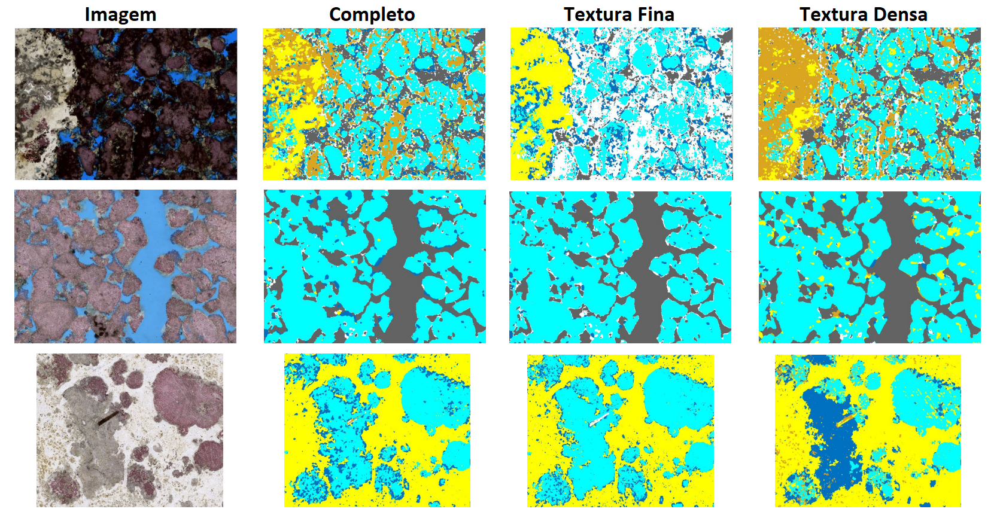
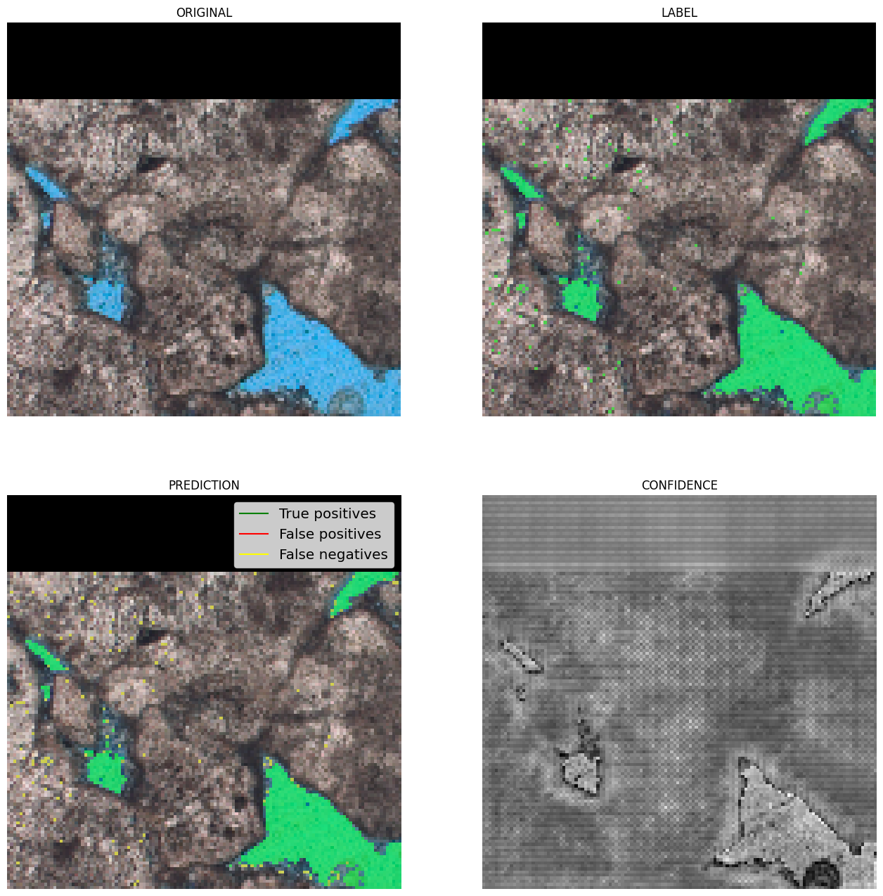
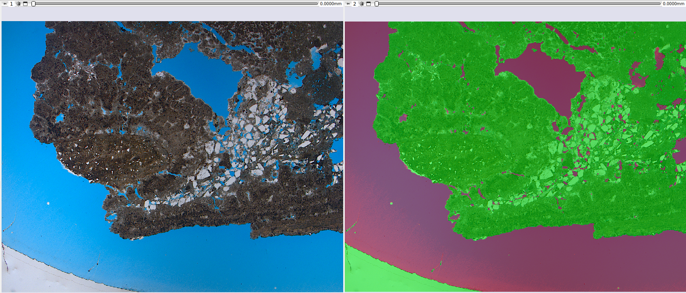

## Segmentação Automática de Lâminas Delgadas

A segmentação de imagens de lâminas petrográficas pode ser feita de duas formas: uma segmentação binária, que identifica apenas a fase de poro, e uma segmentação multifásica, que identifica os diversos minerais que compõem a rocha.

### Segmentação Multifásica (Minerais)

A análise da composição mineral e da textura das rochas é fundamental para a indústria de petróleo. O GeoSlicer utiliza modelos de Deep Learning para automatizar essa análise a partir de imagens de lâminas, oferecendo uma alternativa ao método QEMSCAN.

#### Rede Neural Convolucional (U-Net)

Para a segmentação mineralógica, o GeoSlicer emprega uma rede neural convolucional com a arquitetura **U-Net**. Este tipo de rede é ideal para segmentação semântica, pois atribui uma classe a cada pixel da imagem, delimitando com precisão a região de cada elemento. A U-Net é composta por um caminho de codificação, que extrai características da imagem em múltiplas escalas, e um caminho de decodificação, que reconstrói o mapa de segmentação.

|  |
|:-----------------------------------------------:|
| Figura 1: Arquitetura exemplo da U-Net. |

##### Treinamento

O treinamento dos modelos foi realizado com mais de 50 lâminas de alta resolução, utilizando imagens de Luz Natural (PP) e Polarização Cruzada (PX). O resultado do QEMSCAN foi usado como gabarito. As imagens PP, PX e QEMSCAN foram alinhadas através de um processo de registro, e o treinamento focou em uma região de interesse (SOI) para minimizar ruídos de borda. Para aumentar a diversidade dos dados, os recortes das lâminas passaram por transformações aleatórias, como rotações e inversões. Os modelos foram treinados para identificar **Poros** e os minerais **Calcita**, **Dolomita**, **Mg-Argilominerais**, **Quartzo** e uma classe genérica de **Outros**.

##### Resultados

Os modelos finais, integrados ao GeoSlicer, apresentam boas aproximações da composição mineral, especialmente para o estudo de texturas e da distribuição das fases. Abaixo, um exemplo de predição sobre lâminas não vistas durante o treinamento.

|  |
|:-----------------------------------------------:|
| Figura 2: Predição dos modelos finais sobre lâminas desconhecidas. |

### Segmentação Poro/Não-poro

A porosidade é um indicador crucial do potencial de um reservatório. O GeoSlicer oferece métodos automáticos para segmentar os poros, que são tipicamente preenchidos com resina azul para destaque.

#### Redes Neurais Convolucionais (U-Net)

Assim como na segmentação multifásica, a arquitetura U-Net é utilizada para a segmentação de poros.

##### Treinamento

O modelo foi treinado com 85 imagens de lâminas, onde a segmentação de referência foi obtida por limiar de cor sobre a resina azul. As lâminas foram divididas em recortes de 128x128 pixels, e apenas as áreas úteis (delimitadas pela SOI) foram consideradas. O treinamento durou 300 épocas, com aplicação de modificações aleatórias (rotações, inversões) para diversificar os dados e melhorar a capacidade de generalização do modelo.

##### Resultados

O modelo alcançou um desempenho satisfatório, com um coeficiente de Dice (sobreposição) superior a 85%. Os resultados mostram que a rede consegue identificar os poros com alta confiança, embora possa apresentar algumas dificuldades nas bordas, onde as cores são intermediárias.

| { width=50% }{ width=50% } |
|:-----------------------------------------------:|
| Figura 3: Exemplos de resultados. Em verde, os verdadeiros positivos; em vermelho, os falsos positivos; e em amarelo, os falsos negativos. |

### Inferência Bayesiana

Como alternativa às redes neurais, a Inferência Bayesiana oferece um modelo mais simples para a segmentação poro/não-poro. Este método utiliza a **regra de Bayes** para calcular a probabilidade de um pixel pertencer a um segmento (poro ou não-poro) com base em uma média e uma matriz de covariância aprendidas durante o treinamento.

A abordagem utiliza uma **Distribuição Normal Multivariada** como função de verossimilhança:

$$ f(x_p|s)=\frac{1}{\sqrt{(2\pi)^k \det \Sigma_s}}\exp\left(-\frac{1}{2}(x_p-\mu_s)^T \Sigma_s^{-1} (x_p-\mu_s)\right) $$ 

Onde $x_p$ é o vetor de pixels em uma janela, e $\mu_s$ e $\Sigma_s$ são a média e a covariância do segmento $s$.

#### Treinamento e Resultados

Para melhorar os resultados, as imagens de lâmina, originalmente em formato RGB, são convertidas para HSV. O modelo foi treinado em um conjunto de dados pequeno (~10 amostras) e, mesmo com uma abordagem simples, produz resultados interessantes para a segmentação poro/não-poro.

| { width=100% } |
|:-----------------------------------------------:|
| Figura 4: Resultado qualitativo da segmentação poro/não-poro por inferência Bayesiana. |

### Referências

*   DE FIGUEIREDO, L. P. et al. (2020). *Direct Multivariate Simulation - A stepwise conditional transformation for multivariate geostatistical simulation*. Computers & Geosciences.

*   DE FIGUEIREDO, L. P. et al. (2017). *Bayesian seismic inversion based on rock-physics prior modeling for the joint estimation of acoustic impedance, porosity and lithofacies*. Journal of Computational Physics.

*   HUNT, B. R. (1977). *Bayesian methods in nonlinear digital image restoration*. IEEE Transactions on Computers.

*   SKILLING, J. & BRYAN, R. K. (1984). *Maximum entropy image reconstruction: general algorithm*. Monthly Notices of the Royal Astronomical Society.

*   HANSON, K. (1993). *Introduction to Bayesian image analysis*. Proc SPIE.

*   HANSON, K. (1990). *Object detection and amplitude estimation based on maximum a-posteriori reconstructions*. Proc. SPIE.

*   GEMAN, S. & GEMAN, D. (1990). *Stochastic Relaxation, Gibbs Distribution and the Bayesian Restoration of Images*. IEEE, Transactions on Pattern Analysis; Machine Intelligence.

*   AITKIN, M. A. (2010). *Statistical inference: an integrated Bayesian/likelihood approach*. CRC Press.

*   MIGON, H. S. et al. (2014). *Statistical Inference: An Integrated Approach*. 2nd ed. CRC Press.

*   GAMERMAN, D. & LOPES, H. F. (2006). *Monte Carlo Markov Chain: Stochastic Simulation for Bayesian Inference*. 2nd ed. Chapman & Hall.
