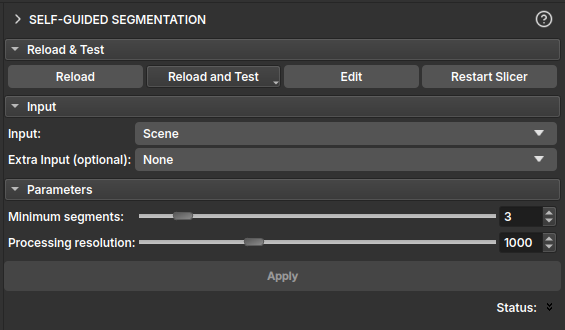

# Segmentação Autoguiada (Não supervisionada)

O módulo de Segmentação Autoguiada realiza a segmentação não supervisionada de uma imagem 2D. Este módulo é particularmente útil para imagens de seções delgadas. Ele utiliza um algoritmo de superpixel juntamente com uma rede neural simples para segmentar a imagem.

## Entradas

- **Input:** Um `vtkMRMLVectorVolumeNode` representando uma imagem colorida com 3 canais RGB ou HSV.
- **Extra Input (opcional):** Um `vtkMRMLVectorVolumeNode` adicional com 3 canais, que pode ser usado como entrada extra para o processo de segmentação. Isso é útil para incorporar dados de outras modalidades de imagem, como imagens PP/PX.

## Parâmetros

- **Mínimo de segmentos:** Este controle deslizante determina o número mínimo de segmentos que o algoritmo produzirá. O algoritmo irá parar se encontrar menos segmentos do que este valor.
- **Resolução de processamento:** Este controle deslizante controla a resolução na qual a segmentação é realizada. A altura da imagem é reduzida para o número especificado de pixels para processamento e a segmentação resultante é então ampliada para o tamanho original da imagem. Isso permite um processamento mais rápido ao custo de alguns detalhes.

## Saída

- **Segmentação de saída:** O módulo gera um `vtkMRMLSegmentationNode` contendo a imagem segmentada. Cada segmento recebe uma cor distinta para fácil visualização.
- **Mesclar segmentos visíveis:** Este botão permite mesclar todos os segmentos atualmente visíveis em um único segmento. Isso é útil para combinar vários segmentos que pertencem à mesma região de interesse.
