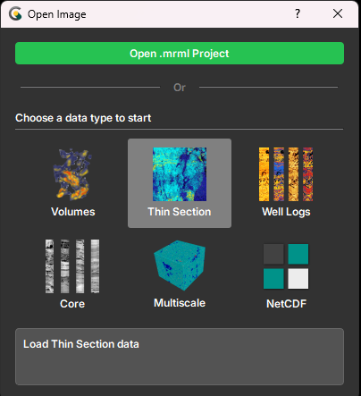
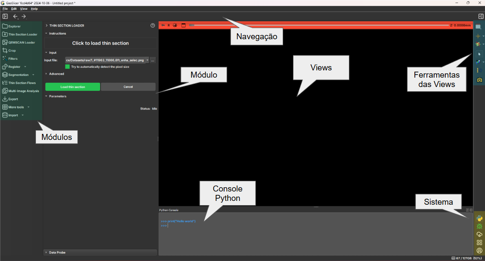

# Interface do Usuário

A interface do GeoSlicer foi recentemente atualizada para melhorar a experiência do usuário.
A interface foi redesenhada para ser mais intuitiva e fácil de usar. A seguir, vamos abordar as principais mudanças
e funcionalidades da nova interface.

## Tela Inicial (Welcome Screen)

O GeoSlicer apresenta uma tela inicial de Boas-Vindas sempre que for aberto. Nela, você pode escolher entre criar um
novo projeto, abrir um projeto existente ou acessar a documentação.

Nela são apresentadas as seguintes opções:

- **Open Project**: Abra um projeto existente.
- **Volumes**: Crie um novo projeto para processar imagens 3D, como tomografias.
- **Thin Section**: Crie um novo projeto para processar imagens de lâminas delgadas.
- **Well Log**: Crie um novo projeto para processar imagens de perfis de poços.
- **Core**: Crie um novo projeto para processar imagens de testemunhos de poços.
- **Multiscale**: Crie um novo projeto para processar imagens de diferentes escalas.
- **NetCDF**: Crie um novo projeto para processar arquivos NetCDF.

Ao selecionar um tipo de projeto, você será direcionado para a tela principal do GeoSlicer e apenas os módulos
relacionados a este projeto serão exibidos
na barra de módulos. Caso o usuário precise acessar módulos de outros projetos, basta clicar no ícone  no
canto inferior direito da tela e o menu inicial irá abrir novamente.
Outra maneira é acessar o menu de projetos na barra superior, que indica o projeto atual e permite a troca para outros
tipos de projeto.

## Tela Principal

A tela principal do GeoSlicer é onde você irá interagir com as imagens e realizar as análises. Ela é dividida em três
partes principais:

1. **Barra de Módulos**: No lado esquerdo da tela, contém os módulos disponíveis para o projeto de acordo com a opção
   escolhida na tela inicial.
2. **Barra de Ferramentas**: No lado direito da *view* central, contém as ferramentas de interação com a imagem.
3. ***View* Central**: Onde a imagem é exibida e as análises são realizadas. O *layout* varia de acordo com o tipo de
   dado ou objetivo de visualização.
4. **Barra de Menu**: No topo da tela, contém as opções de menu da aplicação.
5. **Barra de Ferramentas de Visualização**: No topo da *view* central, contém as ferramentas de controle da
   visualização da imagem (por exemplo, centralizar, escala, relacionar eixos e camadas)
6. **Módulo Atual**: No lado esquerdo da *view* central, apresenta o módulo atual em execução e suas opções.
7. **Barra de Sistema**: No lado direito da tela, contém ferramentas de interação com a aplicação, como: console
   python, gerenciador de contas, reportar bugs e outros.
8. **Barra de Status**: Na parte inferior da tela, contém informações sobre a aplicação (e.g uso de memória), processos
   em execução e notificações.

## Principais Mudanças

A seguir, vamos abordar essas alterações e como elas impactam a experiência do usuário.

### Conceito e Usabilidade

A maioria das alterações na interface seguem o principio de manter a ação próxima ao objeto de interesse ou área que
será afetada. A ideia é manter elementos gráficos relacionados próximos, reduzindo o número de cliques e movimentos do
mouse necessários para realizar uma tarefa.

Outro conceito aplicado é de deixar o tipo do projeto conduzir o que está na interface, ou seja, apenas os módulos
relacionados ao tipo de projeto selecionado serão exibidos, ajudando a manter a interface coerente e evitando que o
usuário
se perca em um mar de opções.

O usuário poderá navegar entre os ambientes de projeto de forma rápida e intuitiva, através do menu de ambientes na
barra superior.

Conforme o usuário entra em um novo ambiente, os módulos desse ambiente são carregados e exibidos na barra de módulos.
Caso o usuário retorne a um ambiente já aberto, os módulos serão apresentados instantaneamente, sem a necessidade de
recarregá-los. Isso é especialmente útil para usuários que trabalham com diferentes tipos de dados. Para o caso especial
de trabalhar com perfis de poços, testemunhos e micro CTs, o usuário pode utilizar o ambiente **_Multiscale_**, que dá suporte
especial aos fluxos de trabalhoe envolvendo esses três tipos de dados.

### Barra de Módulos

Os módulos disponíveis agora estão organizados em uma barra lateral, facilitando a navegação e acesso. Alguns icones são
submenus para mais opções de módulos. Como regra estabelecemos que haverá sempre apenas um nível de submenus, dessa
maneira as opções permancem concisas e rapidamente acessíveis. Nessa barra, apenas os módulos relacionados ao tipo de
projeto selecionado serão exibidos. Caso o usuário deseje acessar módulos de outros projetos, basta clicar no ícone  no canto inferior direito da tela, e então os itens da barra serão atualizados para o módulos do tipo de projeto selecionado.

### Barra de Ferramentas

A barra de ferramentas foi reposicionada para o lado direito da tela, ficando próxima da *view* central, uma vez que
essas ferramentas são utilizadas para interagir com a imagem. A ferramentas ali presente são as mesmas das versões
anteriores
e a maioria são ferramentas nativas do GeoSlicer, por isso os ícones foram mantidos.

### Barra de Sistema

Esta barra agrupa um tipo especial de elementos, que são ferramentas de interação com a aplicação, como: console python,
gerenciador de contas, reportar bugs e outros. Essas funcionalidades tem em comum ativar novas telas, normalmente
diálogos e não tem como objetivo principal a interação com a imagem.

### Barra de Status

A barra de status tem três funções principais: apresentar notificações (ex.: se houver algum subprocesso que precisa
comunicar alguma mensagem),
visualização do progresso de processsos em execução, assim como acesso rápido ao módulo que disparou o processo (através
da botão ao lado da barra de progresso). Também
é apresentada a quantidade de memória que o processo do GeoSlicer está consumindo naquele momento.