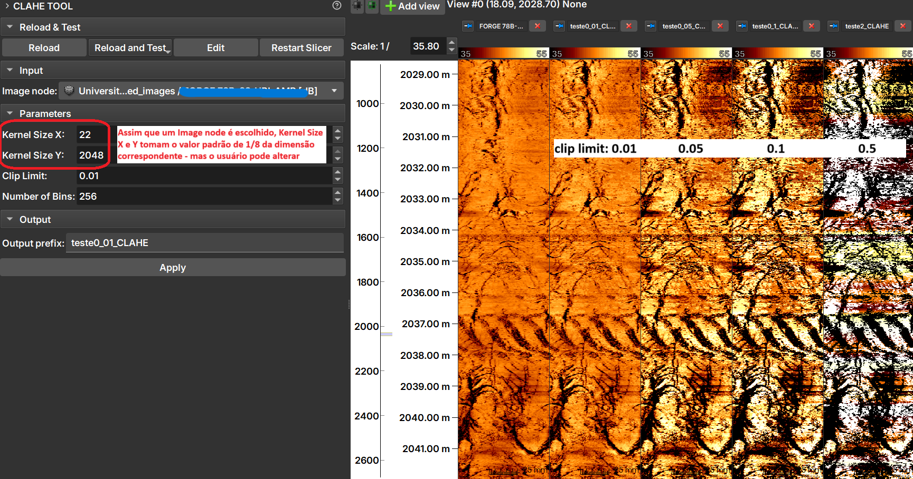

## CLAHE Tool

The _CLAHE Tool_ Module applies Contrast Limit Adaptive Histogram Equalization (CLAHE), "an algorithm for local contrast enhancement, which uses histograms computed over different regions of an image. Thus, local details can be enhanced even in regions lighter or darker than most of the image" - documentation of the equalize_adapthist function from scikit-image on 06/25/2025.

### Panels and their usage

|  |
|:-----------------------------------------------:|
| Figure 1: CLAHE Tool module presentation. |

The image shows the result of applying CLAHE with different _clip limit_ values.

### Inputs
1. __Image Node__: Image Log volume to be processed.

### Parameters
1. __Kernel Size__: Defines the shape of the contextual regions used in the algorithm. By default, kernel_size is 1/8 of the image height by 1/8 of the width.
2. __Clip Limit__: Normalized between zero 0 and 1. High values result in higher contrast.
3. __Number of Bins__: Number of bins for the histograms ('data range').

### Outputs
1. __Output prefix__: Processed image, with float64 type.