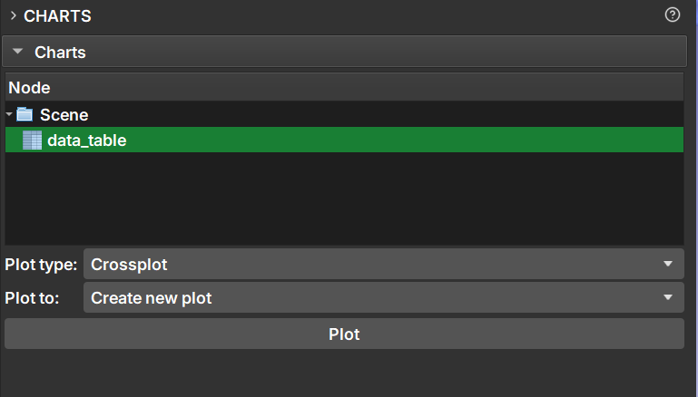
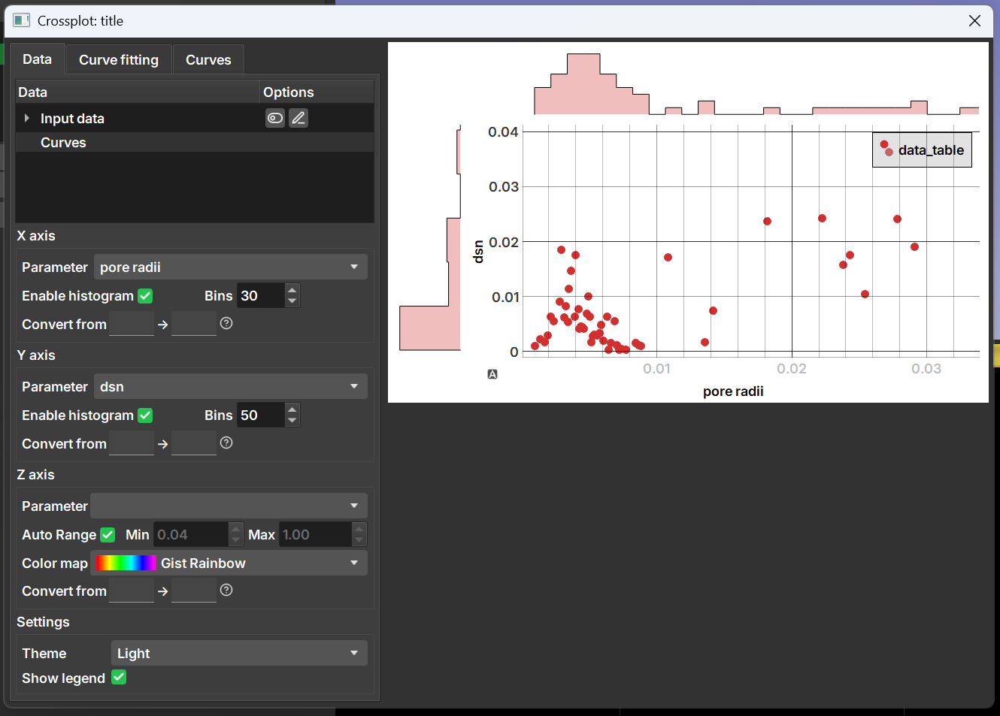
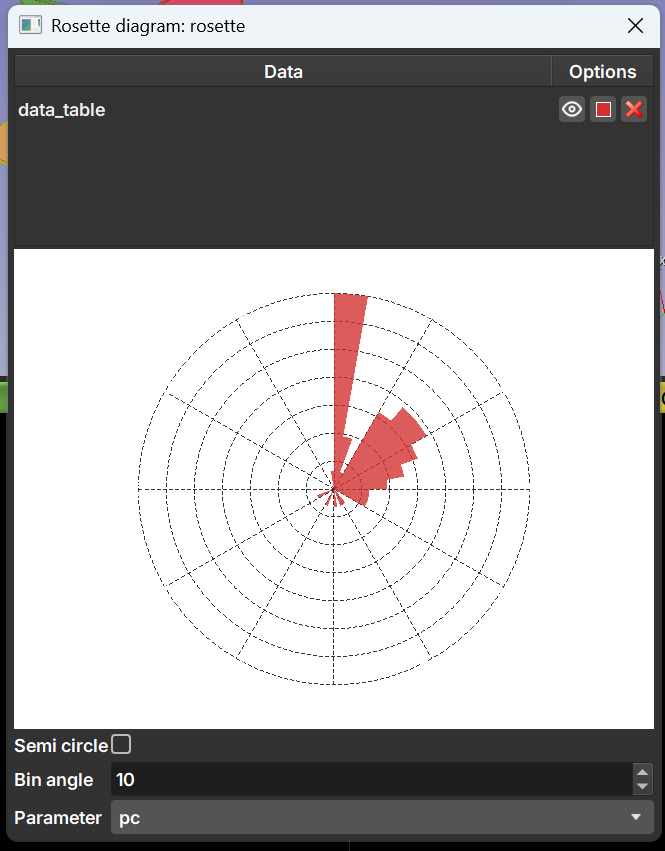
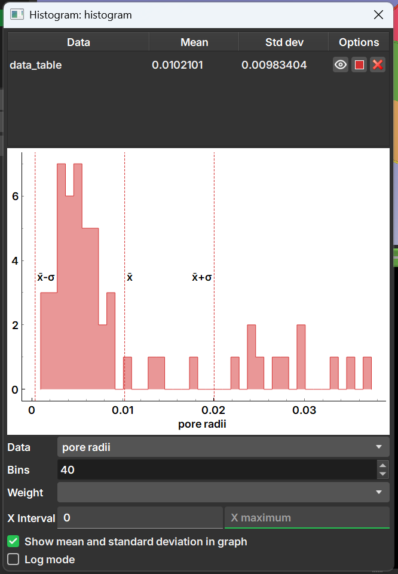

## Charts

This module is used to generate charts based on a table node generated in GeoSlicer. In the module interface, the user can select one or more tables to generate a chart based on the data.

After selecting the tables with the data to be plotted, you can select the chart type in the **Plot type** field; the chart options are:

- **Crossplot**: A combination of a scatter plot, with histograms for each of the axes and color selection according to a third column.

Allows curve fitting or addition of curves to the chart for comparison in the "Curve fitting" and "Curves" tabs.

- **Rosette Diagram**: Diagram typically used to show the frequency and distribution of directional data.

- **Transition**

- **Histograms in depth**

- **Histogram**: Simple histogram of the data in one of the columns. Allows selection of the number of bins and re-weighting according to another column.

