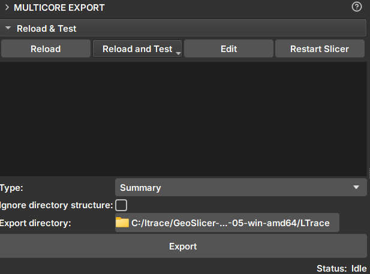

## Multicore Export

_GeoSlicer_ module to export the summary, core slices, and unfolded images of cores.

### Panels and their use

|  |
|:-----------------------------------------------:|
| Figure 1: Multicore Export Module. |

#### Inpaint

- Selector: Selects one or more volumes for export.

- _Type_: Data type to be exported. Available options:
    - _Summary_: Creates an html file for viewing core information.
    - _CSV_: In two formats with depth columns and image CT intensities. One of them is compatible with Techlog software.
    - _PNG_: Export option for the unfolded image.
    - _TIF_: .tiff file of the core volume.

- _Ignore directory structure_: If selected, all files will be saved in the selected directory, without creating new sub-directories.

- _Export directory_: Directory where the files will be saved

- _Export_: Exports to the chosen directory.