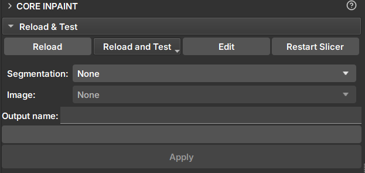

## Core Inpaint

_GeoSlicer_ module for filling rock gaps using segments.

### Panels and their use

|  |
|:-----------------------------------------------:|
| Figure 1: Core Inpaint Module. |

### Inpaint

- _Segmentation_: Segmentation of the core that will be filled.

- _Image_: Core volume with scalar values.

- _Segments_: Segment selector for segments to be filled. At least one segment must be filled.

- _Output name_: Name of the filled volume that will be generated by the module.

- _Apply_: Applies the filling to the selected segment.