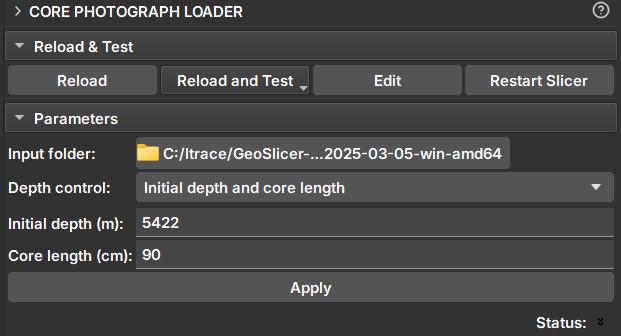

# Core Photograph Loader

_GeoSlicer_ module to extract core images from core box photos and build a complete volume with the core image.

## Panels and their usage

|  |
|:-----------------------------------------------:|
| Figure 1: Core Photograph Loader Module. |

### Parameters

- _Input folder_: Directory containing the core box images.
Adds directories that contain core data. These directories will appear in the _Data to be processed_ list. During execution, data will be searched only one level below.

- _Depth control_: Choose the method to set the core boundaries:
    - _Initial depth and core length_
        - _Initial depth (m)_: Depth of the top of the core.
        - _Core length (cm)_: Length of the core.
    - _Core boundaries CSV file_
        - _Core depth file_: Selector for a CSV file containing core boundaries in meters. In the same CSV file format as the Multicore Module.
    - _From photos (OCR)_