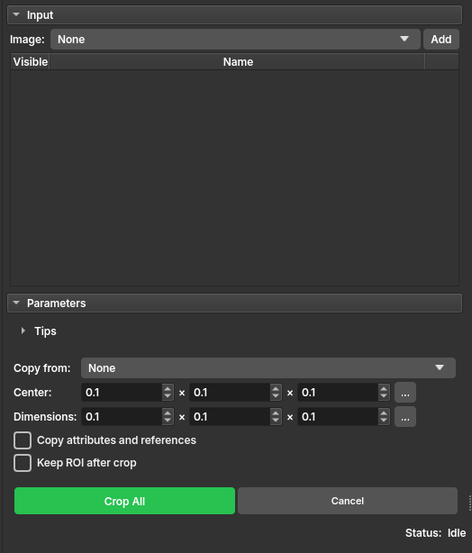

## Volumes Crop

The **Volumes Crop** module allows for efficient cropping of one or multiple volumes simultaneously using a customizable Region of Interest (ROI). It supports Scalar, Vector, and LabelMap volumes, ensuring that all related data can be processed with a consistent spatial boundary.

### Panels and their usage

|  |
|:------------------------------------------------:|
|    Figure 1: Presentation of the Crop module.    |

### Main options

**Input**
 - _Image_: Select an image and click **Add**. You can add multiple images to the list; they will all be cropped using the same ROI configuration. Use the radio buttons in the **Visible** column to choose which volume to use as a reference in the slice views.

**Parameters**
 - _Copy from_: (Optional) Select an existing ROI to define the crop region.
 - _Center_: Set the precise center of the crop in IJK coordinates. Click the **...** button to select from the last 10 used configurations.
 - _Dimensions_: Define the crop size in the three dimensions (X, Y, Z). Click the **...** button to select from the last 10 used configurations.
 - _Copy attributes and references_: If checked, the cropped volumes will inherit metadata, attributes, and references from the original volumes.
 - _Keep ROI after crop_: If checked, the temporary ROI will be kept as a permanent node in the scene after cropping.

**Actions**
 - _Crop All/Cancel_: Buttons to start the batch cropping process or cancel and clear the list.

### Usage

1. Select the images to be cropped and add them to the table.
2. Adjust the ROI interactively in the slice views or manually via the Center and Dimensions fields.
3. (Optional) Hold the **Alt** key while dragging ROI anchors in the slice views to resize symmetrically around the center.
4. Click **Crop All** and wait for completion. The cropped volumes will appear in the same subject hierarchy folder as the original volumes.
