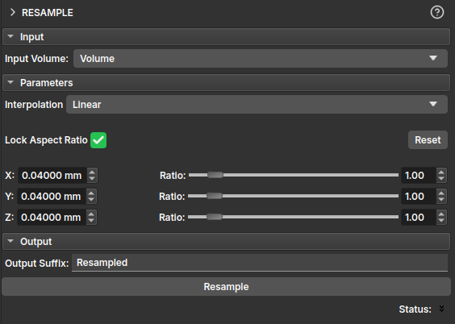

## Resample

The **Resample** module allows changing the spatial resolution of a volume using interpolation, modifying the voxel size along the **X**, **Y**, and **Z** axes. This process is useful for standardizing volumes, by increasing or decreasing their size, or for reducing file sizes for specific analyses that do not require such high resolution.

The parameters available in the module are:

- **Interpolation**: defines the interpolation method used for resampling, which can be:
	+ *Linear*: linear interpolation between voxels;
	+ *Nearest Neighbor*: assigns the value of the nearest neighbor to the new voxel;
	+ *Lanczos*: interpolation based on windowed sinc function. Read more at ;
	+ *Bspline*: smooth interpolation using polynomial curves;
	+ *Mean*: calculates the average of the original voxels that correspond to the new voxel. Useful for reducing resolution while preserving the general trend of the data.
- **Lock Aspect Ratio**: when activated, maintains the aspect ratio between the X, Y, and Z axes.
- **Reset**: restores the original voxel spacing values.
- **X / Y / Z**: defines the new voxel size in millimeters (mm) for each axis.
- **Ratio**: shows the change ratio relative to the original voxel size. Can be adjusted manually using the sliders.
- **Resample**: Executes the resampling process.