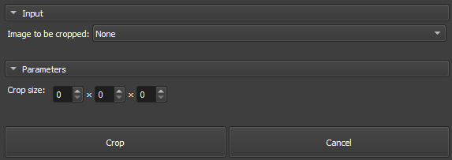

## Volumes Crop

The _Volumes Crop_ module is a tool integrated into GeoSlicer, designed to allow customized cropping of image volumes in IJK coordinates, using a specific Region of Interest (ROI). The module is especially useful for focusing on specific areas of larger volumes, adjusting the cut dimension according to user needs.

### Panels and their usage

|  |
|:-----------------------------------------------:|
| Figure 1: Presentation of the Crop module. |

### Main options

 - _Volume to be cropped_: Choose the Image to be Cropped.

 - _Crop Size_: Define the crop size in the three dimensions (X, Y, Z), interactively adjusting the ROI limits. In the case of 2D images, the Z value will always be 1.

 - _Crop/cancel_: Dedicated buttons to start the cropping process and cancel ongoing operations.

_GeoSlicer_ module to crop a volume, as described in the steps bellow:

1. Select the _Volume to be cropped_.
   
2. Adjust the ROI in the slice views to the desired location and size.
   
3. Click _Crop_ and wait for completion. The cropped volume will appear in the same directory as the original volume.
