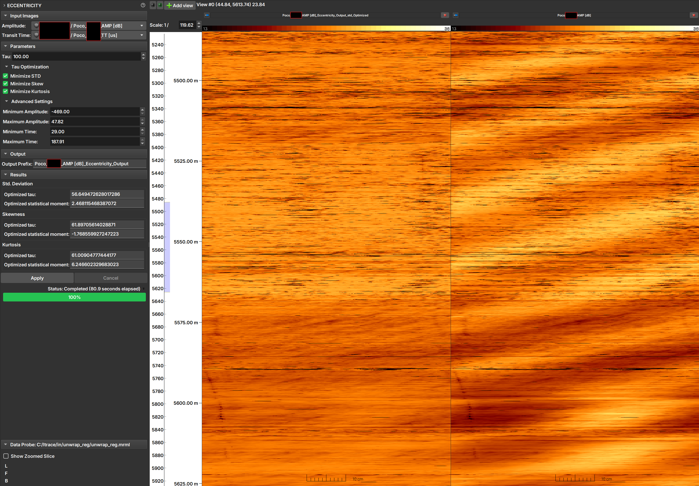

## Eccentricity

Ultrasonic image profiles can suffer from eccentricity, which occurs when the tool is not centered in the well. This can cause artifacts in the amplitude image, where one side of the well appears to have systematically lower amplitude than the other. The Eccentricity module corrects these artifacts using transit time to compensate for amplitude variations.

### Theory

The correction method is based on patent US2017/0082767, which models amplitude attenuation with distance (related to transit time) using an exponential decay. The key parameter in this model is "Tau".

The correction is applied point by point to the image. The ideal "Tau" value is one that produces a corrected image with certain desired statistical characteristics. The module can optimize "Tau" by minimizing one or more of the following statistical moments of the corrected image's amplitude distribution:

-   **Standard Deviation:** Seeks the smallest amplitude variation in the image.
-   **Skewness:** Seeks an amplitude distribution that is as symmetrical as possible.
-   **Kurtosis:** Seeks an amplitude distribution with "tails" similar to a normal distribution.

### How to Use

|  |
|:-----------------------------------------------:|
| Figure 1: Eccentricity module interface, result, and original image. |

#### Input Images

1.  **Amplitude:** Select the amplitude image to be corrected.
2.  **Transit Time:** Select the corresponding transit time image.

#### Parameters

1.  **Tau:** Enter a "Tau" value to be used for correction. This value is only used if none of the optimization options below are selected.
2.  **Tau Optimization:**
    -   **Minimize STD:** Check this option for the module to find the "Tau" that minimizes the standard deviation of the corrected image.
    -   **Minimize Skew:** Check to find the "Tau" that minimizes the (absolute) skewness of the corrected image.
    -   **Minimize Kurtosis:** Check to find the "Tau" that minimizes the kurtosis of the corrected image.

    !!! note "Note"
        It is possible to select multiple optimization options. In this case, an output image will be generated for each selected option. If no option is checked, the correction will be performed using the "Tau" value manually entered in the **Tau** field.

#### Advanced Settings

This section allows refining the optimization process by ignoring pixel values that might be noise or anomalies.

-   **Minimum / Maximum Amplitude:** Defines the range of amplitude values to be considered in the optimization calculation. Pixels with values outside this range will be ignored.
-   **Minimum / Maximum Time:** Defines the range of transit time values to be considered in the optimization calculation. Pixels with values outside this range will be ignored.

#### Output

-   **Output Prefix:** Enter the prefix to be used in the name of the output images. The final name will include the optimization type (e.g., `_std_Optimized`).

#### Results

This section displays the results for each optimization performed.

-   **Optimized tau:** The optimal "Tau" value found by the optimization process.
-   **Optimized statistical moment:** The value of the statistical moment (standard deviation, skewness, or kurtosis) corresponding to the optimized "Tau".

#### Execution

-   **Apply:** Starts the correction process.
-   **Cancel:** Cancels the execution of the process.

### References

- MENEZES, C.; COMPAN, A. L. M.; SURMAS, R. **Method to correct eccentricity in ultrasonic image profiles**. US Patent No. US2017/0082767. 23 mar. 2017.