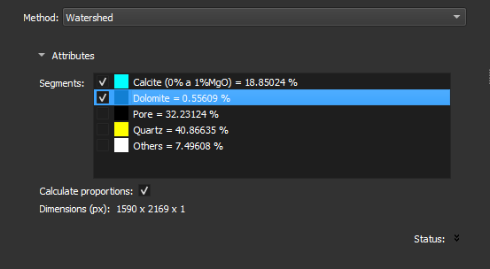

### Auto-fragment

Divide the current segmentation into multiple objects using the chosen method.

Choose which segments in the current segmentation to divide into objects using the checkboxes. The selected segments will be considered as one in the fragmentation algorithm.

**Corresponding Module**: *[Segment Inspector](/ThinSection/Segmentation/Segmentation.md#segment-inspector)*

#### Interface Elements

- **Method:** Select the desired method to divide the segments. Options include:
    - **Watershed**: Divides segments by finding basins in the underlying image values.
    - **Separate objects**: Divides segments into contiguous regions. Objects will not touch each other.

- **Segments:**
    - List of segments currently in the image with checkboxes to choose which ones should be divided.
    - Each segment is represented by its color and name.

- **Calculate proportions:** Checkbox to enable or disable the calculation of segment proportions. If enabled, shows the area of each segment relative to the region of interest.