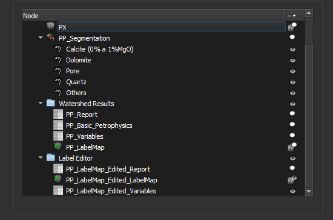

### Finish

This step presents the results of the workflow. All project images are listed, including inputs, outputs, and intermediate images.

Upon completing the workflow, you can:

- View the results (Click the eye icon in the results list)
- Save the project (Ctrl+S)
- Export the results using the *Thin Section Export* module
- Click `Next` to run the workflow with another image.

**Corresponding module**: *Explorer*

#### Interface Elements

All current project data is listed, this includes data generated in this workflow or in other processes.

The report is generated in the *Auto-label* step and is optionally recalculated in the *Edit labels* step. Both tables are listed. The same applies to the object map (*labelmap*).