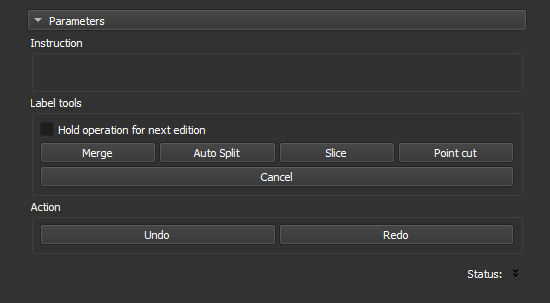

### Edit Objects

Separate or merge objects detected in the previous step.

After editing, press `Next` to recalculate pore metrics and generate a new report table. Press `Skip` to skip the calculation if there are no changes.

**Corresponding module**: *Label Editor*

#### Interface Elements

This step shows the object map generated in the previous step (*auto-label*). Click an operation and then click an object in the image to execute it.

- **Hold operation for next edition**: Select this option to perform an operation (e.g., `Merge`) several times consecutively without needing to select the operation again.
- **Merge**: Click two objects to unite them. Shortcut: `m`.
- **Auto Split**: Click to automatically split an object using the *watershed* technique. Shortcut: `a`.
- **Slice**: Click to cut the object with a straight line. Define the line with two clicks on the image. Shortcut: `s`.
- **Point cut**: Click to cut the object at a specific point. Shortcut: `c`.
- **Cancel**: Click to cancel the current operation.
- **Undo**: Click to undo the last action. Shortcut: `z`.
- **Redo**: Click to redo the last undone action. Shortcut: `x`.