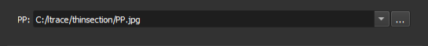
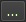

### Load PP/PX

Choose the PP (plane polarized) image files to load.

**Corresponding module**: *[Thin Section Loader](/ThinSection/Loader/ThinSectionLoader.md)*

#### Interface Elements

Specify the path to the image in the **PP** field.

Next to the field, there is a button  that opens the system's file explorer, in order to select the file.

#### Accepted formats

- JPEG
- TIFF
- PNG