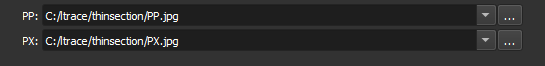

### Load PP/PX

Choose the PP (plane-polarized) and PX (cross-polarized) image files to load.

**Corresponding module**: *[Thin Section Loader](/ThinSection/Loader/ThinSectionLoader.md)*

#### Interface Elements

Specify the path to the images in the **PP** and **PX** fields.

Next to each field, there is a button  which opens the system's file explorer to select the file.

#### Accepted Formats

- JPEG
- TIFF
- PNG