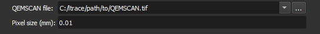

### Load QEMSCAN

Choose the QEMSCAN image file to be loaded.

**Corresponding module**: *[QEMSCAN Loader](/ThinSection/Loader/QemscanLoader.md)*

#### Interface Elements

- QEMSCAN file
Specify the path to the QEMSCAN image.

Next to this field, there is a button  that opens the system's file explorer, in order to select the file.

If there is a single CSV file in the same folder as the image, this will be used to define the name and color of each image segment. If there isn't, a standard QEMSCAN table is used.

- Pixel size (mm)

Specify the size of each image pixel in millimeters.

#### Accepted Formats

- TIFF (image)
- CSV (color table)