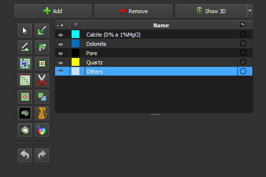

### Manual Segmentation

Edit the segmentation with manual tools. This step can be used to edit the segmentation created in the previous step (*Smart-seg*), or to edit a new segmentation.

**Corresponding module**: *[Segment Editor](/ThinSection/Segmentation/Segmentation.md#manual-segmentation)*

#### Interface Elements

Main page: *[Segment Editor](/ThinSection/Segmentation/Segmentation.md#manual-segmentation)*