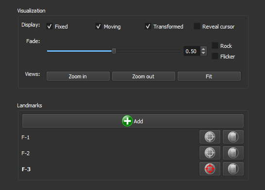
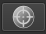

### Register

Register the PP image with the PX image, ensuring they are spatially aligned.

Check if the images need alignment, for example, using the `Rock` function. If they are already aligned, skip this step with the `Skip` option.

If registration is necessary, click the `Add` button, then click on the image to add a marker. Drag the same marker onto the other image so that it is in the same position on both images.

Add more markers until the images are aligned.

**Corresponding Module**: *[Thin Section Registration](/ThinSection/Register/Register.md)*

#### Interface Elements

##### Display

- **Display**:
  - **Fixed**: Selects the view of the PP image.
  - **Moving**: Selects the view of the PX image.
  - **Transformed**: Selects the view of the *Transformed* image. This image shows both images overlaid.

- **Fade**: Adjusts the opacity between the overlaid images. Use the slider to change the opacity and the numerical field to set a specific value.

- **Rock**: Activates the alternate view of the images in a back-and-forth motion.

- **Flicker**: Rapidly switches between images.

- **Views**:
  - **Zoom in**: Zooms in on the view of all images.
  - **Zoom out**: Zooms out on the view of all images.
  - **Fit**: Fits the images to the viewing window.

##### Markers (Landmarks)

- **Add**: Click this button to add a new marker to the image.
- **List of markers**: Displays the added markers. Each listed marker includes:
  - **Selection button** : Selects the marker.
  - **Deletion button** : Deletes the marker.