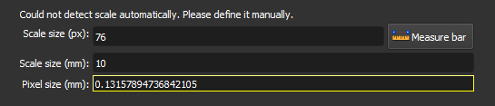

### Define the Scale

Define the pixel size in millimeters for the image.

In this step, the PP image must be visible. If the image has a scale bar, it can be detected automatically, and the fields will be filled in automatically. In this case, check the values and proceed to the next step.

If detection fails, the following message will appear: `Could not detect scale automatically. Please define it manually.` In this case, it is necessary to define the scale manually. If the pixel size is known, fill it directly into the `Pixel size (mm)` field. If not, the pixel size can be calculated by measuring the scale bar on the image.

Defining the scale is important to ensure that the pore metrics calculated later are physically correct.

**Corresponding module**: *[Thin Section Loader](/ThinSection/Loader/ThinSectionLoader.md)*

#### Interface Elements

- **Scale size (px)**: Enter the size of the scale bar in pixels (px). Use the `Measure bar` button to measure directly on the image.

- **Measure bar**: Click this button to use the measurement tool, which will allow you to draw a line on the image to measure the scale bar in pixels. With the tool active, click one end of the bar, then click the other end. The `Scale size (px)` field will be filled with the measured size.

- **Scale size (mm)**: Enter the real size of the scale bar in millimeters (mm). This value should be visible on the image, next to the bar. For example, if it says "0,1 cm", enter "1" in the field.

- **Pixel size (mm)**: This field displays the calculated pixel size value in millimeters, based on the values entered in the `Scale size (px)` and `Scale size (mm)` fields. This value is automatically updated when the previous fields are filled.