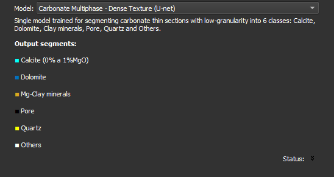

### Smart Segmentation

Automatically segment the image using a machine learning model. If you prefer to segment the image manually, skip this step with the `Skip` option.

**Corresponding Module**: [Automatic Segmentation (Thin Section)](/ThinSection/Segmentation/Segmentation.md#automatic-thin-section-segmentation) 

#### Interface Elements

- **Model**: Select the model to be used to segment the image. After selecting, information about the model will appear, including description and output segments. Each model segments the image into a specific set of classes.