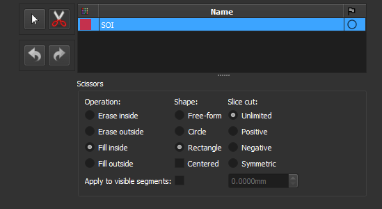
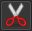

### Define the Segment of Interest

Select the segment of interest (SOI) for the PP/PX images.

Some images may include regions that are not part of the rock, especially at the edges. This step allows you to define the relevant region.

The subsequent *Smart-seg* and *Auto-label* steps will only be executed in this region.

To define the segment, draw rectangles on the image. If you prefer freehand drawing, select the *Free-form* option.

**Corresponding module**: *[Segment Editor](/ThinSection/Segmentation/Segmentation.md#manual-segmentation)*

#### Interface Elements

##### Segmentation Tools

-  **No editing**: Use this icon to interact with the visualization (zoom, move, etc.) instead of drawing the segment.
-  **Scissors**: Use this icon to activate the scissors tool, used to edit the segment of interest.

##### Scissors Options

- **Operations**:
    - **Erase inside**: Erase part of the segment that is inside the drawn region.
    - **Erase outside**: Erase part of the segment that is outside the drawn region.
    - **Fill inside**: Fill segment inside the drawn region.
    - **Fill outside**: Fill segment outside the drawn region.
- **Shapes**:
    - **Free-form**: Draw freehand shapes.
    - **Circle**: Draw circles.
    - **Rectangle**: Draw rectangles.
-  **Undo/Redo**: Undo or redo the last change.