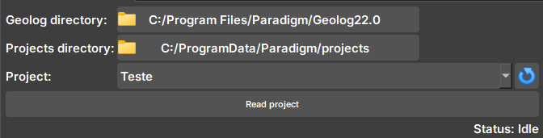
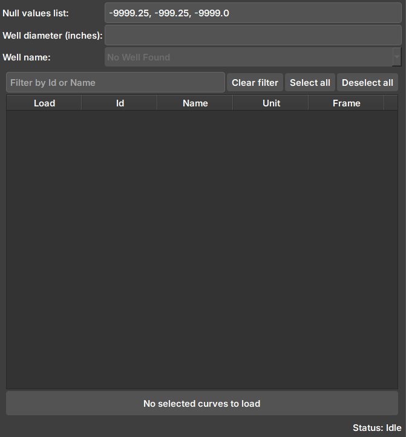
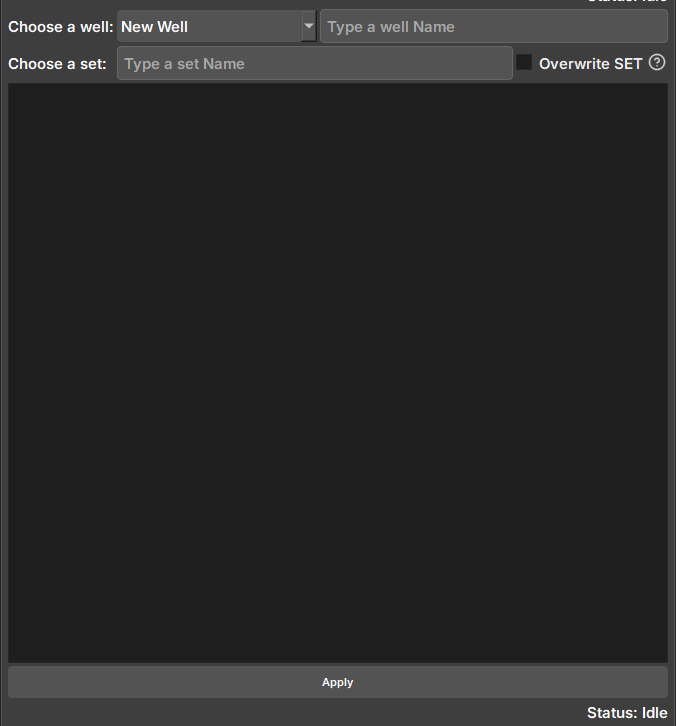

## Geolog Integration

The *Geolog Integration* Module was developed to establish an efficient connection with the *Geolog* software, facilitating the import and export of image log data between the softwares. For its full operation, it is necessary to use Python 3.8 in *Geolog*, as this version includes essential libraries for the integration.

### Panels and their usage

#### Reading a Geolog project

Widget responsible for checking if Geolog is available and reading a Geolog project, checking available WELLS, SETS, and LOGS.

|  |
|:-----------------------------------------------:|
| Figure 1: Geolog connection widget. |

 - _Geolog directory_: Geolog installation directory.

 - _Projects directory_: Directory of the folder with the project to be read.

 - _Project_: Selector for available projects within the directory. If necessary, the button next to it updates the selector to show new projects.

#### Importing data from Geolog
Widget responsible for showing available data for import from Geolog to Geoslicer.

|  |
|:-----------------------------------------------:|
| Figure 2: Geolog data import widget. |

 - _Null values list_: Values considered as null. Imported images are checked if they contain the values in the list and undergo processing.

 - _Well diameter_: Well diameter (inches). Used in the calculation of pixels and attributes of the created volume.

 - _Well name_: Well name in Geolog. Contains the SETS and LOGS to be imported.

 - _Selector_: After connecting and selecting a well, the available data (LOGS) to be imported will appear here.

#### Exporting data to Geolog
Widget responsible for selecting and exporting image log data from Geoslicer to Geolog.

|  |
|:-----------------------------------------------:|
| Figure 3: Geolog data export widget. |

 - _Choose a well_: Selector for available Wells in the project. Selecting the "New Well" option will create a new well during export, with the name entered in the adjacent field.

 - _Choose a set_: Field to enter the name of the SET where the data will be saved. SETs cannot be modified, and choosing an existing SET may overwrite the data if the option next to it is selected.

 - _Selector_: Selector for Geoslicer data to be exported. Due to the way writing occurs in Geolog, volumes must have the same vertical pixel size to avoid data failures.