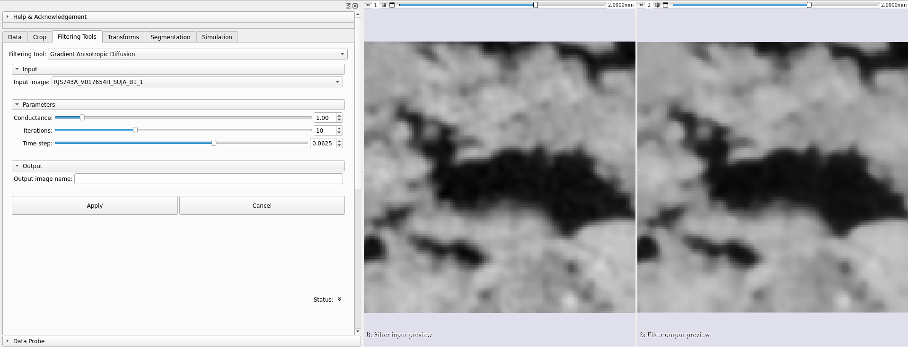
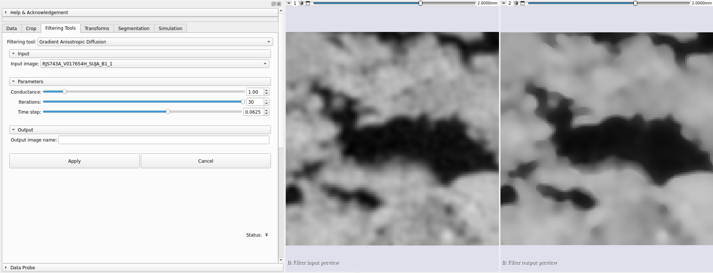
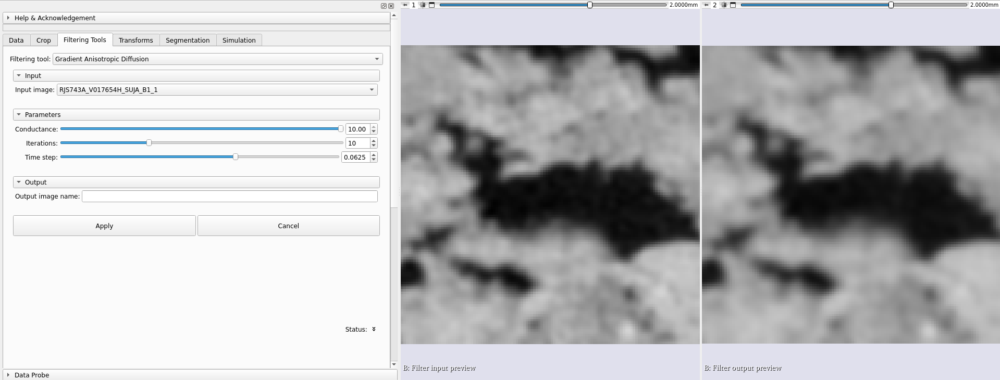
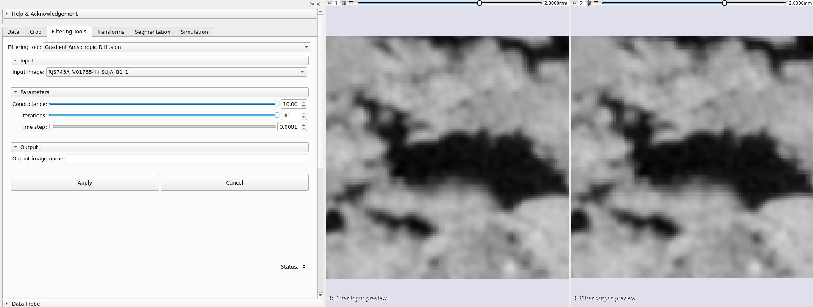

## Gradient Anisotropic Diffusion

Applies gradient anisotropic diffusion to a volume. Anisotropic diffusion methods reduce noise in images while preserving image features, such as edges. In many applications, it is assumed that transitions between light and dark (edges) are of interest. Standard isotropic diffusion methods often blur boundaries between light and dark. Anisotropic diffusion methods are formulated specifically to preserve edges. The conductance term in this case is a function of the image gradient magnitude at each point, reducing the diffusion strength at edges. The numerical implementation of this equation is similar to that described in the Perona-Malik paper, but uses a more robust technique for gradient magnitude estimation and is generalized to N-dimensions.

### Parameters for the anisotropic diffusion algorithm

Condutância (conductance): Controls the sensitivity of the conductance term. As a general rule, the lower the value, the more strongly the filter will preserve edges. A high value will cause diffusion (smoothing) of the edges. Note that the number of iterations controls how much smoothing there will be within regions delimited by edges.

Iterações (numberOfIterations): The more iterations, the greater the smoothing. Each iteration takes the same amount of time. If one iteration takes 10 seconds, 10 iterations take 100 seconds.

Passo temporal (timeStep): The time step depends on the image dimensionality. For three-dimensional images, the default value of 0.0625 provides a stable solution. In practice, changing this parameter causes few changes to the image.

### Examples

|                                                |
|:--------------------------------------------------------------------------------------------:|
| Figure 1: Example of algorithm application to a volume with default parameter values |

|                                                                                      |
|:----------------------------------------------------------------------------------------------------------------------------------:|
| Figure 2: Example of how the iterations parameter affects the result. In this case, a high value led to more well-defined edges. |

|                                                                                      |
|:----------------------------------------------------------------------------------------------------------------------------------:|
| Figure 3: Example of how the conductance parameter affects the result. In this case, a high value led to a more blurred image. |

|                                                                                              |
|:------------------------------------------------------------------------------------------------------------------------------------------:|
| Figure 4: Example of how the conductance parameter affects the result. In this case, a low value led to a result similar to the input. |
