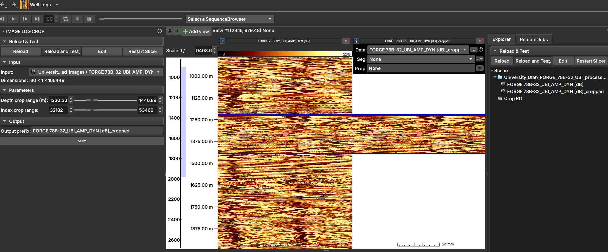

## Image Log Crop

The _Image Log Crop_ Module allows custom cropping of well images, adjusted based on the top and bottom depths of the image.

### Panels and their use

|  |
|:-----------------------------------------------:|
| Figure 1: Manipulation can be done using _sliders_ and numerical values (on the left), or by dragging the crop region with the mouse over the well image (in the center). After clicking "Apply", the cropped image can be opened and viewed, as shown in the image on the right. |

_Sliders_ manipulations (on the left in Image 1) are automatically reflected in the crop region (in the center of the image) and vice-versa.

### Main options

 - _Input_: Choose the image to be cropped. 

 - _Depth crop range (m)_: Lower and upper limits of the depth range that will constitute the crop, in meters.

 - _Index crop range_: The same limits as above, but expressed in indices.

 - By dragging the crop region with the mouse over the well image (in the center)