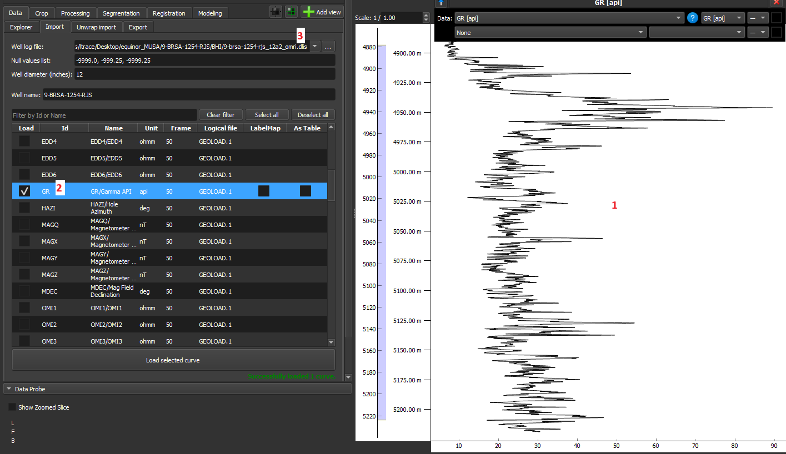
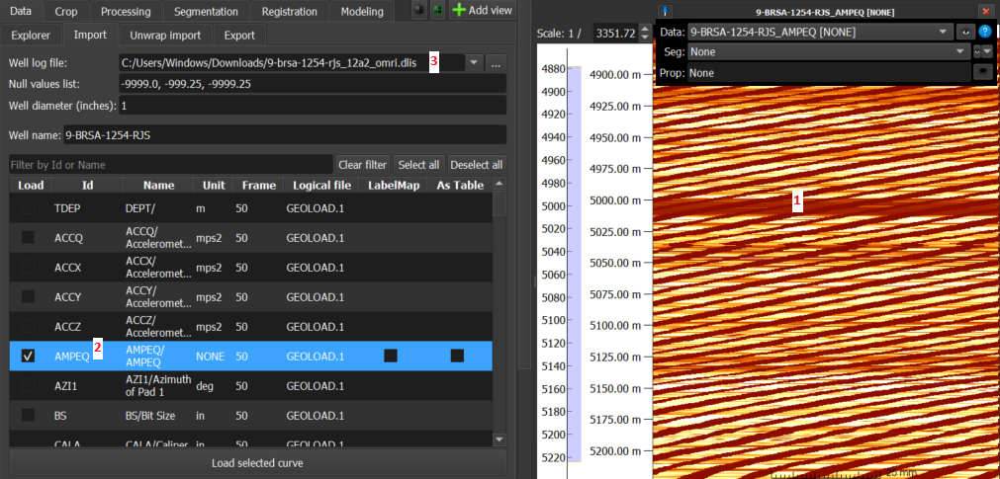
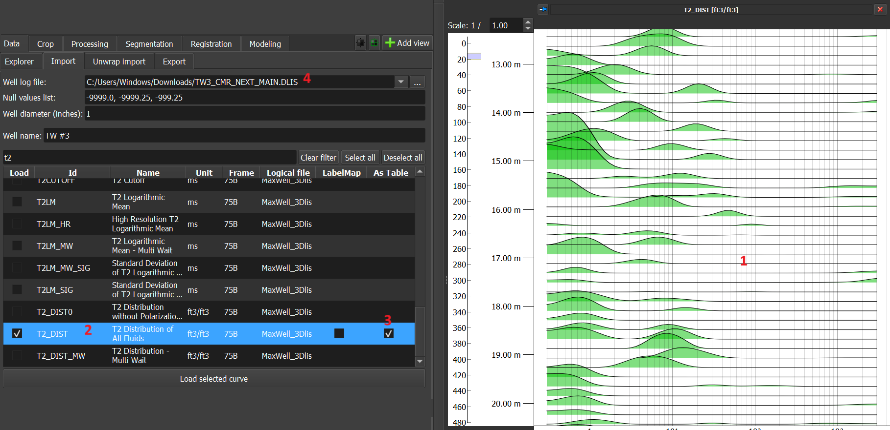
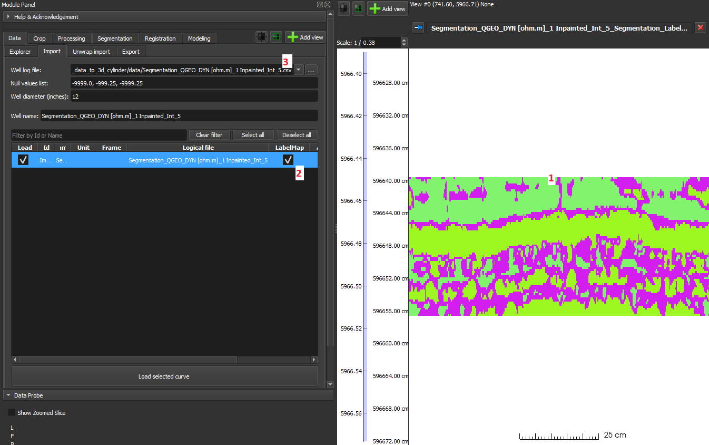

## ImageLog Import
_GeoSlicer_ module for loading profile data in DLIS, LAS, and CSV, as described in the steps below:

1. Select the well log file under _Well Log File_.

2. Edit _Null values list_ and add or remove values from the list of possible null values.

3. Choose the desired profiles to be loaded into GeoSlicer, according to each option described below:

    - 1-D data should be loaded without selecting the “As Table“ and “LabelMap” options and are displayed as line graphs in the Image Log View.
      
    - 2-D data can be loaded as volumes, tables, or LabelMap in GeoSlicer, with each of the options detailed below:

        - Volume: This is the default GeoSlicer option, without checking 'As Table' and 'LabelMap', where the data is loaded as a volume and displayed as an image in the Image Log View.
          
        - Tables: In this option, by checking the 'As Table' checkbox, the data is loaded as a table and is displayed as several histograms, as in the case of the t2_dist data in Figure 3 below:
          
        - LabelMap: In this option, by checking the 'LabelMap' checkbox, assuming segmented data, it is loaded as a LabelMap and displayed as a segmented image.
          

### Formatting of files to be loaded

#### LAS

Sequential curves with mnemonics in the format `mnemonic[number]` will be grouped into 2-D data. For example, the mnemonics of an image with 200 columns:

```
AMP[0]
…
AMP[199]
```

The same file can contain both 1-D and 2-D data. In the following example, AMP is an image, while LMF1 and LMF2 are 1-D data:

```
AMP[0]
…
AMP[199]
LMF1
LMF2
```

#### CSV

For GeoSlicer to interpret CSV data as 2-D, the mnemonics simply need to be of the same name followed by an index in square brackets, as in the 1st example of the LAS section above (AMP[0], …, AMP[199]).
Unlike the LAS case, the file must contain only 2-D data.