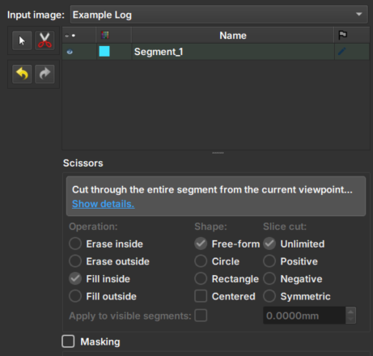

## Image Log Inpaint

The _Image Log Inpaint_ Module integrated into GeoSlicer is an inpainting tool that allows interactive inpainting of missing or damaged areas in well images, with dynamic adjustments during the process.

### Panels and their usage

|  |
|:-----------------------------------------------:|
| Figure 1: Presentation of the Image Log Crop module. |

#### Main options

 - _Input image_: Choose the image to be inpainted. When an image is chosen, two views will be automatically added to facilitate usability.

 - _Clone Volume_: Creates a new image to be used in the module, keeping the original image unchanged.

 - _Rename Volume_: Renames the chosen image.

 - _Tesoura/Scissors_: Tool that performs the inpainting: first, select the tool and then draw on the image the area where the inpainting should be performed. The tool options in the bottom menu are disabled in this module.

 - _Arrows_: Allow to undo or redo an inpainting modification.